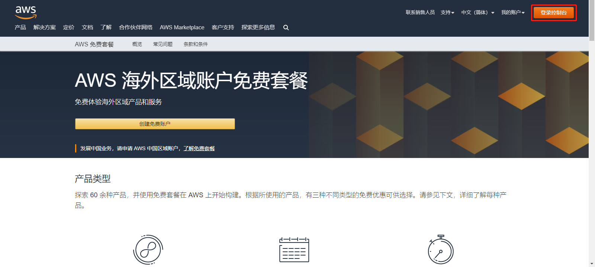
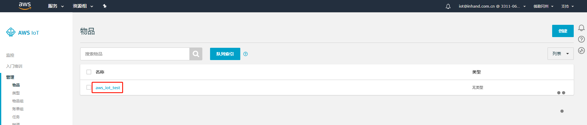
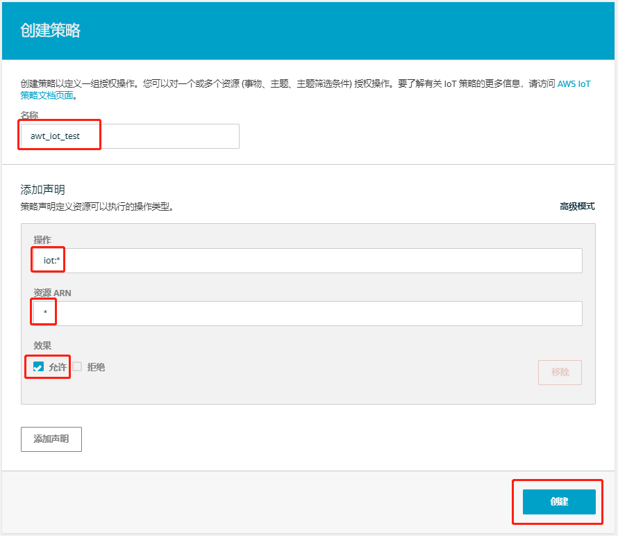

# AWS IoT使用说明
AWS IoT 可在连接了 Internet 的设备（如传感器、致动器、嵌入式微控制器或智能设备）与 AWS 云之间提供安全的双向通信。这样，您便能从多台设备收集遥测数据，然后存储和分析数据。  

为便于用户实现设备与AWS IoT的对接，边缘计算网关InGateway902（以下简称IG902）提供Device Supervisor App（以下简称Device Supervisor）对接AWS IoT。本文档将以IG902为例为你说明如何实现Device Supervisor与AWS IoT的业务数据上报和配置数据下发，关于AWS的使用限制请参考[AWS服务配额](https://docs.aws.amazon.com/zh_cn/general/latest/gr/aws_service_limits.html#limits_iot)。

  - [先决条件](#prerequisites)
  - [1. 环境准备](#environmental-preparation)
    - [1.1 AWS IoT配置](#aws-iot-configuration)
      - [1.1.1 创建事物](#create-thing)
      - [1.1.2 创建策略](#create-strategy)
      - [1.1.3 配置证书](#configure-certificate)
    - [1.2 边缘计算网关配置](#edge-computing-gateway-configuration)
      - [1.2.1 基础配置](#basic-configuration)
      - [1.2.2 配置数据采集](#configure-data-collection)
  - [2. 发布和订阅消息](#start-test)
    - [2.1 连接AWS IoT](#connect-to-aws-iot)
    - [2.2 发布消息到AWS IoT](#publish-to-aws-iot)
    - [2.3 订阅AWS IoT的消息](#subscrip-aws-iot)
  - [附录](#appendix)
    - [Device Supervisor的AWS IoT api接口说明](#aws-iot-api-interface-description-of-device-supervisor)


<a id="prerequisites"> </a>

## 先决条件

- AWS云平台账号
- 边缘计算网关IG501/IG902
  - 固件版本
    - IG902：`IG9-V2.0.0.r12754`及以上
    - IG501：`IG5-V2.0.0.r12884`及以上
  - SDK版本
    - IG902：`py3sdk-V1.4.0_Edge-IG9`及以上
    - IG501：`py3sdk-V1.4.0_Edge-IG5`及以上
  - App版本：`device_supervisor-V1.2.5`及以上

<a id="environmental-preparation"> </a>

## 1. 环境准备

  - [1.1 AWS IoT配置](#aws-iot-configuration)
  - [1.2 边缘计算网关配置](#edge-computing-gateway-configuration)

<a id="aws-iot-configuration"> </a>

### 1.1 AWS IoT配置

  - [1.1.1 创建事物](#create-thing)
  - [1.1.2 创建策略](#create-strategy)
  - [1.1.3 配置证书](#configure-certificate)

如果你已经在AWS的IoT控制台中配置了相应的事物、策略和证书，可以直接查看下一节[1.2 边缘计算网关配置](#edge-computing-gateway-configuration)。否则请按照如下流程配置IoT控制台。  
访问AWS官网 https://aws.amazon.com/ 并登录控制台，中国区域的用户可以使用AWS中国区域的AWS服务，地址为 https://cn-northwest-1.console.amazonaws.cn。<font color=#FF0000>需要注意的是，两者的数据相互独立</font>。登录控制台后选择“IoT Core”，使用中国AWS服务时选择“AWS IoT”。  

  

  

登录“IoT Core”后页面如下所示：  

  

<a id="create-thing"> </a>

#### 1.1.1 创建事物
选择“管理 > 物品”进入“物品”页面点击“注册物品”或“创建”以创建物品。  

    

  选择“创建单个物品”。  
  
    
  
  随后为物品设置名称，如`aws_iot_test`，其余项使用默认配置即可，配置完成后点击“下一步”。  

    
  
  点击“创建证书”。  

    

<a id="download-file"> </a> 

  证书创建完成后需要下载物品的证书、私有秘钥和AWS IoT的根CA（下载根 CA 证书时建议下载`Amazon Root CA 1`或`Starfield 根 CA 证书`，<font color=#FF0000>目前不支持“Amazon Root CA 3”证书</font>）并激活证书，之后点击“完成”以完成创建物品。
  
    

  
  
  物品创建成功后如下图所示：  
  
    

<a id="create-strategy"> </a>

#### 1.1.2 创建策略
  选择“安全 > 策略”进入“策略”页面点击“创建策略”或“创建”以创建策略。  

    

  在“创建策略”页面输入策略名称并参考下列配置来配置策略（该策略使所有客户端都能连接到AWS IoT），配置完成后点击“创建”完成策略创建。  
  - “操作”中填入`iot:*`  
  - “资源ARN”中填入`*`  
  - “效果”选择“允许”  

    
  
  策略创建成功后如下图所示：  

    

<a id="configure-certificate"> </a>

#### 1.1.3 配置证书
  选择“安全 > 证书”进入“证书”页面，如下图所示：  

    

  - 附加策略  

    点击证书右侧的“**...**”并选择“附加策略”为证书附加策略。  

      
    
    随后选择相应的策略并点击“附加”。  

      

    策略附件成功如下图所示：  

    
 
  - 附加物品  
  
    点击证书右侧的“**...**”并选择“附加物品”为证书附加物品。  

      

    随后选择相应的物品并点击“附加”。  
    
      
    
    物品附加成功如下图所示：  

      

至此，完成了AWS IoT环境准备。  

<a id="edge-computing-gateway-configuration"> </a>

### 1.2 边缘计算网关配置

  - [1.2.1 基础配置](#basic-configuration)
  - [1.2.2 配置数据采集](#configure-data-collection)

<a id="basic-configuration"> </a>

#### 1.2.1 基础配置
如何配置IG902联网、更新软件版本等操作请参考[IG902快速使用手册](http://manual.ig.inhand.com.cn/zh_CN/latest/IG902%E5%BF%AB%E9%80%9F%E4%BD%BF%E7%94%A8%E6%89%8B%E5%86%8C.html)。  

<a id="configure-data-collection"> </a>

#### 1.2.2 配置数据采集
Device Supervisor详细的基础数据采集配置见[Device Supervisor App用户手册](http://app.ig.inhand.com.cn/zh_CN/latest/Device-Supervisor%E7%94%A8%E6%88%B7%E6%89%8B%E5%86%8C-CN.html)。本文档的数据采集配置如下：

  

<a id="start-test"> </a>

## 2. 发布和订阅消息

  - [2.1 连接AWS IoT](#connect-to-aws-iot)
  - [2.2 发布消息到AWS IoT](#publish-to-aws-iot)
  - [2.3 订阅AWS IoT的消息](#subscrip-aws-iot)

<font color=#FF0000>以美元符号 ($) 开头的主题保留供 AWS IoT 使用。你可以在允许的情况下订阅和发布到这些保留的主题；但是，你不能创建以美元符号开头的新主题。对保留的主题执行不受支持的发布或订阅操作可能会导致连接终止。AWS IoT的保留主题见[保留的主题](https://docs.aws.amazon.com/zh_cn/iot/latest/developerguide/reserved-topics.html)。</font>  

<a id="connect-to-aws-iot"> </a>

### 2.1 连接AWS IoT
进入IG902的“边缘计算 > 设备监控 > 云服务”页面，勾选“启用云服务”并选择类型为“AWS IoT”。示例配置如下：  

  

各项参数说明如下：  
- `类型`：连接AWS IoT时，选择“AWS IoT”
- `服务器地址`：AWS IoT的终端节点地址，可从AWS IoT的“设置”页面获取。<font color=#FF0000>使用“VeriSign Class 3 Public Primary G5 根 CA 证书”时，请删除地址中的“-ats”</font>  
  
  

- `MQTT客户端ID`：任一唯一ID
- `物品的证书`：导入创建物品时下载的物品证书或自定义证书
- `私有密钥`：导入创建物品时下载的私有秘钥或自定义私有秘钥
- `CA证书`：导入用于服务器身份验证的CA证书，你可以从[这里](https://docs.aws.amazon.com/zh_cn/iot/latest/developerguide/server-authentication.html)下载相应的CA证书（建议使用`Amazon Root CA 1`或`Starfield 根 CA 证书`）。<font color=#FF0000>目前不支持“Amazon Root CA 3”证书</font>  

  

<a id="publish-to-aws-iot"> </a>

### 2.2 发布消息到AWS IoT
- 步骤1：配置发布消息  

  在“云服务 > 消息管理”中添加一条发布消息，配置如下：    

    

  脚本如下：
  ```python
  import logging
  from datetime import datetime
  """
  在网关中打印日志通常有两种办法。
  1.import logging：使用logging.info(XXX)打印日志，该方法的日志显示不受全局参数页面中的日志等级参数控制。
  2.from common.Logger import logger：使用logger.info(XXX)打印日志，该方法的日志显示受全局参数页面中的日志等级参数控制。
  """
  
  def vars_upload_test(data_collect, wizard_api): #定义发布主函数
      value_list = [] #定义数据列表
      for device, val_dict in data_collect['values'].items(): #遍历values字典，该字典中包含设备名称和设备下的变量数据
          value_dict = { #自定义数据字典
                        "Device": device,
                        "timestamp": data_collect["timestamp"],
                        "Data": {}
                        }
          for id, val in val_dict.items(): #遍历变量数据，为Data字典赋值
              value_dict["Data"][id] = val["raw_data"]
          value_list.append(value_dict) #依次将value_dict添加到value_list中
      logging.info(value_list) #在App日志中打印value_list，数据格式为[{'Device': 'S7-1200', 'timestamp': 1589538347.5604711, 'Data': {'Test1': False, 'Test2': 12}}]
      return value_list #将value_list发送给App，App将自行按照采集时间顺序上传至MQTT服务器。如果发送失败则缓存数据等待连接恢复后按采集时间顺序上传至MQTT服务器
  ```

  发布消息配置参数说明如下：  
- `名称`：用户自定义发布名称
- `主题`：发布主题，与MQTT服务器订阅的主题保持一致
- `Qos(MQTT)`：发布Qos，建议与MQTT服务器的Qos保持一致
  - `0`：只发送一次消息，不进行重试  
  - `1`：最少发送一次消息，确保消息到达MQTT服务器
- `分组类型`：发布变量数据时请选择“采集”，随后在`分组`中仅能选择“采集组”；发布告警数据时请选择“告警”，随后在`分组`中仅能选择“告警组”
- `分组`：选择相应的分组后，分组下所有变量通过该发布配置将数据上传至MQTT服务器；可选择多个分组,当选择多个分组时，按照分组的采集间隔分别对各分组下的变量执行发布中的脚本逻辑。<font color=#FF0000>分组中必须包含变量，否则不会执行发布中的脚本逻辑</font>
- `主函数`：主函数名称，即入口函数名称，与脚本中的入口函数名称保持一致
- `脚本`：使用Python代码自定义组包和处理逻辑，主函数参数包括：
  - `参数1`：同[标准MQTT-发布](http://app.ig.inhand.com.cn/zh_CN/latest/Device-Supervisor%E7%94%A8%E6%88%B7%E6%89%8B%E5%86%8C-CN.html#id18)主函数中的`参数1`
  - `参数2`：Device Supervisor的AWS IoT api接口，参数说明见[Device Supervisor的AWS IoT api接口说明](#aws-iot-api-interface-description-of-device-supervisor)

- 步骤2：在AWS IoT中订阅消息
  
  进入AWS IoT的“测试”页面，在“订阅主题”中输入IG902的发布主题，本文档为`awsiot/test`。  

    

  

- 步骤3：查看AWS IoT接收的消息
  
  订阅主题后，可在订阅主题页面查看收到的消息内容。  

  

<a id="subscrip-aws-iot"> </a>

### 2.3 订阅AWS IoT的消息
- 步骤1：配置订阅消息  

  在“云服务 > 消息管理”中添加一条订阅消息，配置如下：    

    

  订阅消息配置参数说明如下：  

    - `名称`：自定义订阅名称
    - `主题`：订阅主题，与MQTT服务器发布的数据主题保持一致
    - `Qos(MQTT)`：订阅Qos，默认为0
    - `主函数`：主函数名称，即入口函数名称，与脚本中的入口函数名称保持一致
    - `脚本`：使用Python代码自定义组包和处理逻辑，自定义Topic的订阅主函数参数包括：
      - `参数1`：该参数为接收到的主题，数据类型为`string`
      - `参数2`：该参数为接收到的数据，数据类型为`string`
      - `参数3`：Device Supervisor的AWS IoT api接口，参数说明见[Device Supervisor的AWS IoT api接口说明](#aws-iot-api-interface-description-of-device-supervisor)

- 步骤2：在AWS IoT中发布消息

  进入AWS IoT的“测试”页面，在“发布消息至一个主题”中输入IG902的订阅主题，本文档为`awsiot/send`。  

    

    

- 步骤3：查看AWS IoT发布的消息
  
  AWS IoT发布消息后，可在App运行日志中查看收到的消息内容。  

  

<a id="appendix"> </a>

## 附录

<a id="aws-iot-api-interface-description-of-device-supervisor"> </a>

### Device Supervisor的AWS IoT api接口说明
`wizard_api`的基础配置方法请参考[Device Supervisor的api接口说明](http://app.ig.inhand.com.cn/zh_CN/latest/Device-Supervisor%E7%94%A8%E6%88%B7%E6%89%8B%E5%86%8C-CN.html#device-supervisorapi)。当云服务类型为`AWS IoT`时，`wizard_api`额外提供以下方法： 

- `awsiot_publish(topic, payload, qos)`
  - `方法说明`：数据上报方法
  - `参数`
    - `参数1`：MQTT主题，数据类型为`string`。通过至该主题发送数据到MQTT服务器  
    - `参数2`：需要发送的数据  
    - `参数3`：qos等级（包括0/1两种等级）
  - `使用示例`：  
    
      

    ```python
    import logging
    from datetime import datetime
    """
    在网关中打印日志通常有两种办法。
    1.import logging：使用logging.info(XXX)打印日志，该方法的日志显示不受全局参数页面中的日志等级参数控制。
    2.from common.Logger import logger：使用logger.info(XXX)打印日志，该方法的日志显示受全局参数页面中的日志等级参数控制。
    """
    
    def vars_upload_test(data_collect, wizard_api): #定义发布主函数
        value_list = [] #定义数据列表
        for device, val_dict in data_collect['values'].items(): #遍历values字典，该字典中包含设备名称和设备下的变量数据
            value_dict = { #自定义数据字典
                          "Device": device,
                          "timestamp": data_collect["timestamp"],
                          "Data": {}
                          }
            for id, val in val_dict.items(): #遍历变量数据，为Data字典赋值
                value_dict["Data"][id] = val["raw_data"]
            value_list.append(value_dict) #依次将value_dict添加到value_list中
        logging.info(value_list) #在App日志中打印value_list，数据格式为[{'Device': 'S7-1200', 'timestamp': 1589538347.5604711, 'Data': {'Test1': False, 'Test2': 12}}]
        wizard_api.awsiot_publish("awsiot/test", value_list, 1) #将value_list发送给App，App将自行按照采集时间顺序上传至MQTT服务器。如果发送失败则缓存数据等待连接恢复后按采集时间顺序上传至MQTT服务器    
    ```