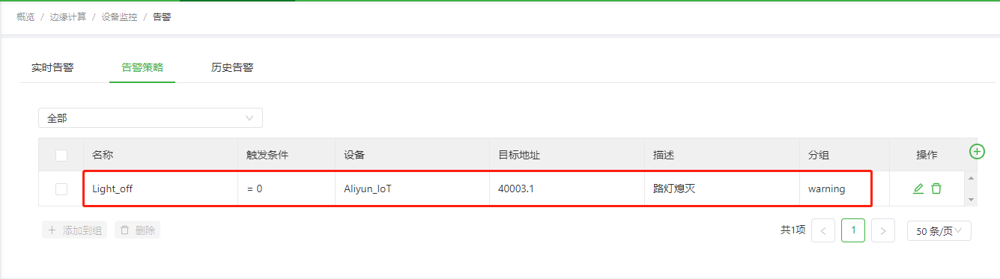
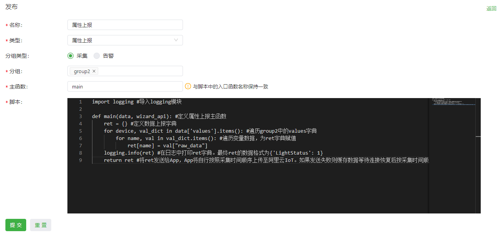
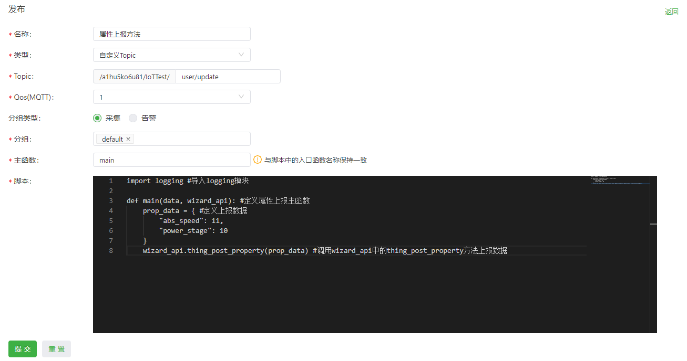

# 阿里云IoT使用说明
越来越多的企业选择将IoT设备迁移上云。为此，阿里云提供企业从自建MQTT集群迁移到阿里云物联网平台（以下简称阿里云IoT）的解决方案，为设备提供安全可靠的连接通信能力，向下连接海量设备，支撑设备数据采集上云；向上提供云端API，服务端通过调用云端API将指令下发至设备端，实现远程控制。  

为便于用户实现设备与阿里云IoT的对接，边缘计算网关InGateway902（以下简称IG902）提供Device Supervisor App（以下简称Device Supervisor）对接阿里云IoT。本文档将以IG902为例为你说明如何实现Device Supervisor与阿里云IoT的业务数据上报和配置数据下发。

  - [先决条件](#prerequisites)
  - [1. 环境准备](#environmental-preparation)
    - [1.1 阿里云配置](#ali-cloud-configuration)
      - [1.1.1 创建产品](#create-product)
      - [1.1.2 创建设备](#create-device)
    - [1.2 边缘计算网关配置](#edge-computing-gateway-configuration)
      - [1.2.1 基础配置](#basic-configuration)
      - [1.2.2 配置数据采集](#configure-data-collection)
  - [2. 发布和订阅消息](#start-test)
    - [2.1 连接阿里云IoT](#connect-to-ali-cloud-iot)
      - [2.1.1 一机一密](#one-machine-one-secret)
      - [2.1.2 一型一密](#one-type-one-secret)
    - [2.2 发布消息到阿里云IoT](#publish-to-ali-cloud-iot)
      - [2.2.1 自定义Topic](#customer-topic)
      - [2.2.2 属性上报](#property-report)
      - [2.2.3 事件上报](#event-report)
    - [2.3 订阅阿里云IoT的消息](#subscrip-ali-cloud-iot)
      - [2.3.1 自定义Topic](#customer-topic2)
      - [2.3.2 服务调用](#service-call)
      - [2.3.3 属性设置](#property-setting)
  - [附录](#appendix)
    - [Device Supervisor的阿里云IoT api接口说明](#ali-cloud-iot-api-interface-description-of-device-supervisor)

<a id="prerequisites"> </a>

## 先决条件
- 阿里云账号
- 边缘计算网关IG501/IG902
  - 固件版本
    - IG902：`IG9-V2.0.0.r12754`及以上
    - IG501：`IG5-V2.0.0.r12884`及以上
  - SDK版本
    - IG902：`py3sdk-V1.4.0_Edge-IG9`及以上
    - IG501：`py3sdk-V1.4.0_Edge-IG5`及以上
  - App版本：`device_supervisor-V1.2.4`及以上

<a id="environmental-preparation"> </a>

## 1. 环境准备

  - [1.1 阿里云配置](#ali-cloud-configuration)
  - [1.2 边缘计算网关配置](#edge-computing-gateway-configuration)

<a id="ali-cloud-configuration"> </a>

### 1.1 阿里云配置

  - [1.1.1 创建产品](#create-product)
  - [1.1.2 创建设备](#create-device)

如果你已经在阿里云的物联网云平台中配置了相应的产品和设备，可以直接查看下一节[1.2 边缘计算网关配置](#edge-computing-gateway-configuration)。否则请按照如下流程配置物联网云平台中的产品和设备。  
访问阿里云官网 https://www.aliyun.com 并登录，登录后选择“物联网平台”。  

  

“物联网平台”页面如下所示：  

  

<a id="create-product"> </a>

#### 1.1.1 创建产品
- 步骤1：创建产品  

  进入“设备管理 > 产品”页面，点击“创建产品”。  

    

  以下为添加一个路灯照明产品的示例。<font color=#FF0000>注意：数据格式仅支持“ICA标准数据格式”，认证方式仅支持“设备密钥”。</font>  

  

- 步骤2：为产品定义物模型（可选）  
  
  创建完成后，点击“前往定义物模型”。  

    

  点击“编辑草稿”以配置产品的功能定义。  

    

  点击“添加自定义功能”并配置相应的“服务”和“事件”，关于服务和事件的介绍请参考[添加单个物模型](https://help.aliyun.com/document_detail/88241.html?spm=a2c4g.11186623.2.38.4a9e429dnWGjOr#task-qhm-d3j-w2b)。<font color=#FF0000>注意：配置服务时，调用方式仅支持异步。</font>   

    

<a id="configure-services"> </a>

  - 配置服务(使用自定义Topic时无需配置此项)  

      

    在“输入参数”下点击“增加参数”，并配置相应的输入参数。

       

<a id="configure-events"> </a>

  - 配置事件(使用自定义Topic时无需配置此项) 

      

    在“输出参数”下点击“增加参数”，并配置相应的输出参数。

    

    配置完成后点击“发布上线”以提交配置。  

    

<a id="export-model-tsl"> </a>

- 步骤3：导出物模型TSL
  
  产品配置完成后，在“功能定义”页面点击“物模型TSL”，随后选择“完整物模型”并点击“导出模型文件”以备后续使用。<font color=#FF0000>注意：导出物模型时不要选择“精简物模型”，否则可能导致数据上报异常。</font>  

  

<a id="create-device"> </a>

#### 1.1.2 创建设备
进入“设备管理 > 设备 > 设备列表”页面，点击“添加设备”。  


选择上一步中创建的产品并配置其他参数。  

  

添加成功后点击“前往查看”查看设备的详细信息。  

  

“设备详情”页面如下图所示：

  

至此，完成了在阿里云的物联网云平台中配置了相应的产品和设备。

<a id="edge-computing-gateway-configuration"> </a>

### 1.2 边缘计算网关配置

  - [1.2.1 基础配置](#basic-configuration)
  - [1.2.2 配置数据采集](#configure-data-collection)

<a id="basic-configuration"> </a>

#### 1.2.1 基础配置
- 如何配置IG902联网、更新软件版本等操作请参考[IG902快速使用手册](http://manual.ig.inhand.com.cn/zh_CN/latest/IG902-Quick-Start-Manual-CN.html)。  
- 如何配置IG501联网、更新软件版本等操作请参考[IG501快速使用手册](http://manual.ig.inhand.com.cn/zh_CN/latest/IG501-Quick-Start-Manual-CN.html)。 

<a id="configure-data-collection"> </a>

#### 1.2.2 配置数据采集
Device Supervisor详细的基础数据采集配置见[Device Supervisor App用户手册](http://app.ig.inhand.com.cn/zh_CN/latest/Device-Supervisor-User-Manual-CN.html)。本文档配置采集了`Custom_topic`和`LightStatus`变量以及一条告警，分别用于[自定义Topic](#customer-topic)、[属性上报](#property-report)和[事件上报](#event-report)。




<a id="start-test"> </a>

## 2. 发布和订阅消息

  - [2.1 连接阿里云IoT](#connect-to-ali-cloud-iot)
  - [2.2 发布消息到阿里云IoT](#publish-to-ali-cloud-iot)
  - [2.3 订阅阿里云IoT的消息](#subscrip-ali-cloud-iot)

<a id="connect-to-ali-cloud-iot"> </a>

### 2.1 连接阿里云IoT

  - [2.1.1 一机一密](#one-machine-one-secret)
  - [2.1.2 一型一密](#one-type-one-secret)

进入IG902的“边缘计算 > 设备监控 > 云服务”页面，勾选“启用云服务”并选择类型为“阿里云IoT”。阿里云IoT的认证方式有两种，一机一密和一型一密。关于认证方式的详细介绍请参考[阿里云设备安全认证](https://help.aliyun.com/document_detail/42649.html?spm=a2c4g.11186623.6.584.11ab7711upKXtS)。  

<a id="one-machine-one-secret"> </a>

#### 2.1.1 一机一密
使用“一机一密”的认证方式与阿里云IoT建立连接时，选择认证方式为“一机一密”。示例配置如下：  

  

各项参数说明如下：
- `类型`：连接阿里云IoT时，选择“阿里云IoT”
- `云端域名`：云端域名的配置方式请参考[地域和可用区](https://help.aliyun.com/document_detail/40654.html?spm=a2c4g.11186623.2.11.6fd37375mB9dmb)。文档中的地域名称为`华东2`，因此使用`cn-shanghai`。  

    

    

- `认证方式`：根据实际情况选择认证方式，本次使用`一机一密`。
- `ProductKey`：进入“设备管理 > 设备 > 设备详情”页面，点击“DeviceSecret”后的“查看”以复制认证信息。

    

- `DeviceName`：获取方法同`一机一密`的ProductKey。
- `DeviceSecret`：获取方法同`一机一密`的ProductKey。
- `物模型TSL`：导入[创建产品](#export-model-tsl)时保存的物模型文件。<font color=#FF0000>说明：“消息管理”中仅使用“自定义Topic”类型的消息时可以不导入物模型。</font>  

连接阿里云IoT成功后如下图所示：  

  

<a id="one-type-one-secret"> </a>

#### 2.1.2 一型一密
使用“一型一密”的认证方式与阿里云IoT建立连接时，选择认证方式为“一型一密”。示例配置如下：  


<font color=#FF0000>注意：</font>
- <font color=#FF0000>认证方式为“一型一密”时，需要开启“动态注册”。</font>
- <font color=#FF0000>仅未激活的设备支持通过`一型一密`认证方式与阿里云IoT建立连接且在连接建立后设备自动激活，激活后IG902切换为`一机一密`与阿里云IoT连接。你可以在“设备详情”页面查看设备是否有激活时间来判断设备是否已激活。</font>  


各项参数说明如下：
- `类型`：连接阿里云IoT时，选择“阿里云IoT”
- `云端域名`：云端域名的配置方式请参考[地域和可用区](https://help.aliyun.com/document_detail/40654.html?spm=a2c4g.11186623.2.11.6fd37375mB9dmb)。文档中的地域名称为`华东2`，因此使用`cn-shanghai`。  

    

    

- `认证方式`：根据实际情况选择认证方式，本次使用`一型一密`。    

   

- `ProductKey`：进入“设备管理 > 产品 > 产品详情”页面，点击“ProductSecret”后的“查看”以复制认证信息。

    

- `DeviceName`：设备名称，获取方法同`一机一密`的ProductKey。
- `ProductSecret`：获取方法同`一型一密`的ProductKey。
- `物模型TSL`：导入[创建产品](#export-model-tsl)时保存的物模型文件。<font color=#FF0000>说明：“消息管理”中仅使用“自定义Topic”类型的消息时可以不导入物模型。</font>  

连接阿里云IoT成功后如下图所示：  

  

<a id="publish-to-ali-cloud-iot"> </a>

### 2.2 发布消息到阿里云IoT

  - [2.2.1 自定义Topic](#customer-topic)
  - [2.2.2 属性上报](#property-report)
  - [2.2.3 事件上报](#event-report)

进入IG902的“边缘计算 > 设备监控 > 云服务”页面，在“消息管理 > 发布”中添加发布消息。发布消息支持三种类型的发布消息：`自定义topic`、`属性上报`和`事件上报`。  

数据上报时的数据格式要求见[物模型开发](https://help.aliyun.com/document_detail/98370.html?spm=a2c4g.11186623.6.686.19c252f7IdbjUF)。<font color=#FF0000>注意：使用属性上报和事件上报时，请确保IG902中的“物模型TSL”与阿里云IoT中产品的物模型一致。</font>

<a id="customer-topic"> </a>

#### 2.2.1 自定义Topic
发布消息类型为`自定义topic`的示例配置如下：  


发布消息配置参数说明如下：  

- `名称`：用户自定义发布名称
- `类型`：发布消息的类型
- `主题`：发布主题，与阿里云IoT的“设备管理 > 产品 > 产品详情 > Topic类列表 > 自定义Topic”页面中“操作权限”为“发布”的Topic类保持一致。<font color=#FF0000>说明：主题中的ProductKey
和DeviceName信息会自动补全，配置主题时复制`${deviceName}/`后的主题信息即可。</font>
  
  

- `Qos(MQTT)`：发布Qos，建议与MQTT服务器的Qos保持一致
  - `0`：只发送一次消息，不进行重试  
  - `1`：最少发送一次消息，确保消息到达MQTT服务器
- `分组类型`：发布变量数据时请选择“采集”，随后在`分组`中仅能选择“采集组”；发布告警数据时请选择“告警”，随后在`分组`中仅能选择“告警组”
- `分组`：选择相应的分组后，分组下所有变量通过该发布配置将数据上传至MQTT服务器；可选择多个分组,当选择多个分组时，按照分组的采集间隔分别对各分组下的变量执行发布中的脚本逻辑。<font color=#FF0000>分组中必须包含变量，否则不会执行发布中的脚本逻辑</font>
- `主函数`：主函数名称，即入口函数名称，与脚本中的入口函数名称保持一致
- `脚本`：使用Python代码自定义组包和处理逻辑，主函数参数包括：
  - `参数1`：同[标准MQTT-发布](http://app.ig.inhand.com.cn/zh_CN/latest/Device-Supervisor-User-Manual-CN.html#publish)主函数中的`参数1`
  - `参数2`：Device Supervisor的阿里云IoT api接口，参数说明见[Device Supervisor的阿里云IoT api接口说明](#ali-cloud-iot-api-interface-description-of-device-supervisor)

<a id="property-report"> </a>

#### 2.2.2 属性上报
你可以进入阿里云IoT的“设备管理 > 产品 > 产品详情 > 功能定义”页面查看产品的属性、事件等信息。示例的产品具备一个名称为“工作状态”的属性，该属性的标识符为“LightStatus”。将[配置数据采集](#configure-data-collection)中配置的“LightStatus”变量通过属性上报上传至阿里云IoT，配置如下。  

  

  

发布消息配置参数说明请参考[发布-自定义Topic](#customer-topic)。脚本代码及说明如下：  
```python
import logging #导入logging模块

def main(data, wizard_api): #定义属性上报主函数
    ret = {} #定义数据上报字典
    for device, val_dict in data['values'].items(): #遍历group2中的values字典
        for name, val in val_dict.items(): #遍历变量数据，为ret字典赋值
            ret[name] = val["raw_data"]
    logging.info(ret) #在日志中打印ret字典。最终ret的数据格式为{'LightStatus': 1}
    return ret #将ret发送给App，App将自行按照采集时间顺序上传至阿里云IoT。如果发送失败则缓存数据等待连接恢复后按采集时间顺序上传至阿里云IoT
```

可在阿里云IoT的“设备管理 > 设备 > 设备详情 > 物模型数据 > 运行状态”页面查看属性状态。  

  

<a id="event-report"> </a>

#### 2.2.3 事件上报
你可以进入阿里云IoT的“设备管理 > 产品 > 产品详情 > 功能定义”页面查看产品的属性、事件等信息。示例的产品具备一个名称为[事件测试](#configure-events)的事件，该事件的标识符为“event_test”，输出参数的标识符为“ErrorCode”。当[配置数据采集](#configure-data-collection)中配置的“event_test”告警触发时，通过事件上报上传至阿里云IoT，配置如下。  

  

  

发布消息配置参数说明请参考[发布-自定义Topic](#customer-topic)。脚本代码及说明如下：  
```python
import logging #导入logging模块

def main(data_collect, wizard_api): #定义事件上报主函数
    res = ("event_test", {"ErrorCode": 0}) #定义事件上报数据
    return res #将ret发送给App，App将自行按照采集时间顺序上传至阿里云IoT。如果发送失败则缓存数据等待连接恢复后按采集时间顺序上传至阿里云IoT
```

可在阿里云IoT的“设备管理 > 设备 > 设备详情 > 物模型数据 > 事件管理”页面查看事件信息。  


<a id="subscrip-ali-cloud-iot"> </a>

### 2.3 订阅阿里云IoT的消息

  - [2.3.1 自定义Topic](#customer-topic2)
  - [2.3.2 服务调用](#service-call)
  - [2.3.3 属性设置](#property-setting)

进入IG902的“边缘计算 > 设备监控 > 云服务”页面，在“消息管理 > 订阅”中添加订阅消息。订阅消息支持三种类型的订阅消息：`自定义topic`、`服务调用`和`属性设置`。

<a id="customer-topic2"> </a>

#### 2.3.1 自定义Topic
订阅消息类型为`自定义topic`的示例配置如下：  


订阅消息配置参数说明如下：  

- `名称`：自定义订阅名称
- `主题`：订阅主题，与阿里云IoT的“设备管理 > 产品 > 产品详情 > Topic类列表 > 自定义Topic”页面中“操作权限”为“订阅”的Topic类保持一致。<font color=#FF0000>说明：主题中的ProductKey
和DeviceName信息会自动补全，配置主题时复制`${deviceName}/`后的主题信息即可。</font>

    

- `Qos(MQTT)`：订阅Qos，默认为1
- `主函数`：主函数名称，即入口函数名称，与脚本中的入口函数名称保持一致
- `脚本`：使用Python代码自定义组包和处理逻辑，自定义Topic的订阅主函数参数包括：
  - `参数1`：该参数为接收到的主题，数据类型为`string`
  - `参数2`：该参数为接收到的数据，数据类型为`string`
  - `参数3`：Device Supervisor的阿里云IoT api接口，参数说明见[Device Supervisor的阿里云IoT api接口说明](#ali-cloud-iot-api-interface-description-of-device-supervisor)

<a id="service-call"> </a>

#### 2.3.2 服务调用
以下是服务调用的示例，该示例可以接受阿里云IoT下发的“服务测试”设置指令。<font color=#FF0000>注意：使用服务测试时，请确保IG902中的“物模型TSL”与阿里云IoT中产品的物模型一致。</font>  


订阅消息配置参数说明请参考[订阅-自定义Topic](#customer-topic2)，服务调用的订阅主函数参数包括：
- `参数1`：服务标识符
- `参数2`：请求ID
- `参数3`：服务输入参数
- `参数4`：预留参数
- `参数5`：Device Supervisor的阿里云IoT api接口，参数说明见[Device Supervisor的阿里云IoT api接口说明](#ali-cloud-iot-api-interface-description-of-device-supervisor)

脚本代码及说明如下：  
```python
import logging #导入logging模块

def main(identifier, request_id, params, userdata, wizard_api): #定义属性设置主函数
    logging.info(identifier) #打印服务标识符
    logging.info(request_id) #打印请求ID
    logging.info(params) #打印服务参数
    wizard_api.thing_answer_service(identifier, request_id, 200, {"Power2": 1}) #调用wizard_api模块中的thing_answer_service方法，返回服务响应信息
```

进入阿里云IoT的“监控运维 > 在线调试 > 调试真实设备 > 服务调用”页面选择相应的产品和设备进行服务调用测试；在“设备管理 > 设备 > 设备详情 > 物模型数据 > 服务调用”页面查看服务调用信息。


  

<a id="property-setting"> </a>

#### 2.3.3 属性设置
以下是属性设置的示例，该示例可以接受阿里云IoT下发的“工作状态”指令。<font color=#FF0000>注意：使用属性设置时，请确保IG902中的“物模型TSL”与阿里云IoT中产品的物模型一致。</font>  


订阅消息配置参数说明请参考[订阅-自定义Topic](#customer-topic2)，属性设置的订阅主函数参数包括：
- `参数1`：下发的属性数据
- `参数2`：预留参数
- `参数3`：Device Supervisor的阿里云IoT api接口，参数说明见[Device Supervisor的阿里云IoT api接口说明](#ali-cloud-iot-api-interface-description-of-device-supervisor)

脚本代码及说明如下：  
```python
import logging #导入logging模块

def main(params, userdata, wizard_api): #定义属性设置主函数
    logging.info(params) #打印params数据
    logging.info(userdata) #打印userdata数据
    wizard_api.write_plc_values({"LightStatus":params["LightStatus"]}) #调用wizard_api模块中的write_plc_values方法，将数据下发至LightStatus变量
```

进入阿里云IoT的“监控运维 > 在线调试 > 调试真实设备 > 属性调试”页面选择相应的产品、设备、调试功能和方法进行属性设置测试；在“设备管理 > 设备 > 设备详情 > 物模型数据 > 运行状态”页面查看设备运行状态。


<a id="appendix"> </a>

## 附录

<a id="ali-cloud-iot-api-interface-description-of-device-supervisor"> </a>

### Device Supervisor的阿里云IoT api接口说明
`wizard_api`的基础配置方法请参考[Device Supervisor的api接口说明](http://app.ig.inhand.com.cn/zh_CN/latest/Device-Supervisor-User-Manual-CN.html#device_supervisor_api_description)。当云服务类型为`阿里云IoT`时，`wizard_api`额外提供以下方法，各方法的说明和格式要求见[物模型开发](https://help.aliyun.com/document_detail/98370.html?spm=a2c4g.11186623.6.686.19c252f7IdbjUF)。 

- thing_post_property(prop_data)
  - `方法说明`：属性上报方法
  - `参数`：prop_data，需要上报的属性数据
  - `使用示例`：
    
     

    ```python
    import logging #导入logging模块
    
    def main(data, wizard_api): #定义属性上报主函数
        prop_data = { #定义上报数据
            "abs_speed": 11,
            "power_stage": 10
        }
        wizard_api.thing_post_property(prop_data) #调用wizard_api中的thing_post_property方法上报数据
    ```

- thing_trigger_event((identifier, event_data))
  - `方法说明`：事件上报方法
  - `参数`：元组数据，包含以下信息
    - `identifier`：阿里云IoT事件标识符
    - `event_data`：告警数据
  - `使用示例`：
  
      

    ```python
    import logging #导入logging模块
    
    def main(data, wizard_api): #定义事件上报主函数
        event_data = {"ErrorCode": 0} #根据事件的输出参数定义事件数据
        wizard_api.thing_trigger_event(("event_test", event_data)) #调用wizard_api中的thing_trigger_event方法上报数据
    ```

- thing_answer_service(identifier, request_id, code, params)
  - `方法说明`：服务响应方法
  - `参数`：
    - `identifier`：服务标识符
    - `request_id`：请求ID
    - `code`：响应代码，代码说明见[设备端通用code](https://help.aliyun.com/document_detail/89309.html?spm=a2c4g.11186623.2.21.4a9e429dnWGjOr#concept-ar5-wtw-y2b)
    - `params`：服务调用参数
  - `使用示例`：
    
    

    ```python
    import logging #导入logging模块
    
    def main(identifier, request_id, params, userdata, wizard_api): #定义服务响应主函数
        logging.info(identifier) #打印服务标识符
        logging.info(request_id) #打印请求ID
        wizard_api.thing_answer_service(identifier, request_id, 200, {"Power2": 1}) #调用wizard_api中的thing_answer_service方法响应服务
    ```