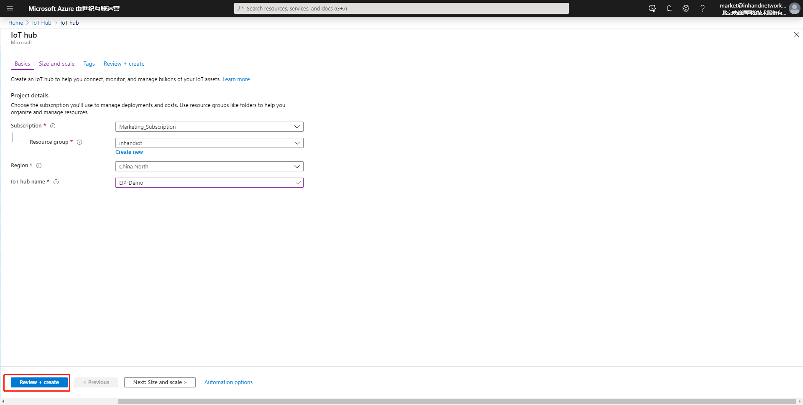
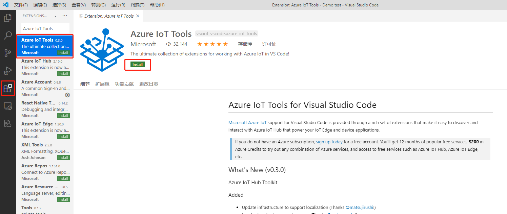

# Azure IoT使用说明
Azure IoT Hub（以下简称Azure IoT）托管服务在云中进行托管，充当中央消息中心，用于 IoT 应用程序与其管理的设备之间的双向通信。 可以使用 Azure IoT，将数百万 IoT 设备和云托管解决方案后端之间建立可靠又安全的通信，生成 IoT 解决方案。 几乎可以将任何设备连接到 IoT Hub。  

为便于用户实现设备与Azure IoT的对接，边缘计算网关InGateway902（以下简称IG902）提供Device Supervisor App（以下简称Device Supervisor）对接Azure IoT。本文档将以IG902为例为你说明如何实现Device Supervisor与Azure IoT的业务数据上报和配置数据下发。

  - [先决条件](#prerequisites)
  - [1. 环境准备](#environmental-preparation)
    - [1.1 Azure IoT配置](#azure-configuration)
      - [1.1.1 添加IoT Hub](#add-iothub)
      - [1.1.2 添加IoT Device](#add-iot-device)
    - [1.2 边缘计算网关配置](#edge-computing-gateway-configuration)
      - [1.2.1 基础配置](#basic-configuration)
      - [1.2.2 配置数据采集](#configure-data-collection)
  - [2. 发布和订阅消息](#start-test)
    - [2.1 连接Azure IoT](#connect-to-azure-iot)
    - [2.2 发布消息到Azure IoT](#publish-to-azure-iot)
    - [2.3 订阅Azure IoT的消息](#subscrip-azure-iot)
  - [附录](#appendix)
    - [发布Azure IoT消息示例](#publish-azure-iot-message-example)
    - [订阅Azure IoT消息示例](#sample-subscription-to-azure-iot-messages)
    - [Device Supervisor的Azure IoT api接口说明](#azure-iot-api-interface-description-of-device-supervisor)
  - [FAQ](#faq)
    - [Q1：连接Azure IoT时，出现频繁连接正常一段时间后又断开](#q1)

<a id="prerequisites"> </a>

## 先决条件

- Azure云平台账号
- 边缘计算网关IG501/IG902
  - 固件版本
    - IG902：`IG9-V2.0.0.r12754`及以上
    - IG501：`IG5-V2.0.0.r12884`及以上
  - SDK版本
    - IG902：`py3sdk-V1.4.0_Edge-IG9`及以上
    - IG501：`py3sdk-V1.4.0_Edge-IG5`及以上
  - App版本：`device_supervisor-V1.2.5`及以上

<a id="environmental-preparation"> </a>

## 1. 环境准备

  - [1.1 Azure IoT配置](#azure-configuration)
  - [1.2 边缘计算网关配置](#edge-computing-gateway-configuration)

<a id="azure-configuration"> </a>

### 1.1 Azure IoT配置

  - [1.1.1 添加IoT Hub](#add-iothub)
  - [1.1.2 添加IoT Device](#add-iot-device)

如果你已经在Azure IoT中配置了相应的IoT Hub和IoT device，可以直接查看下一节[1.2 边缘计算网关配置](#edge-computing-gateway-configuration)。否则请按照如下流程配置Azure IoT。  
访问<https://portal.azure.cn/>登录Azure。  

  

<a id="add-iothub"> </a>

#### 1.1.1 添加IoT Hub  
登录成功后如下图所示，选择“IoT Hub”。  

    

  点击“Add”创建一个IoT Hub。  

    

    

  创建成功后如下图所示：  

    

<a id="add-iot-device"> </a>

#### 1.1.2 添加IoT Device  
在IoT Hub中创建一个IoT Device。  

    

    

    

  创建成功后如下图所示：  

  

<a id="edge-computing-gateway-configuration"> </a>

### 1.2 边缘计算网关配置

  - [1.2.1 基础配置](#basic-configuration)
  - [1.2.2 配置数据采集](#configure-data-collection)

<a id="basic-configuration"> </a>

#### 1.2.1 基础配置
- 如何配置IG902联网、更新软件版本等操作请参考[IG902快速使用手册](http://manual.ig.inhand.com.cn/zh_CN/latest/IG902-Quick-Start-Manual-CN.html)。  
- 如何配置IG501联网、更新软件版本等操作请参考[IG501快速使用手册](http://manual.ig.inhand.com.cn/zh_CN/latest/IG501-Quick-Start-Manual-CN.html)。  

<a id="configure-data-collection"> </a>

#### 1.2.2 配置数据采集
Device Supervisor详细的基础数据采集配置见[Device Supervisor App用户手册](http://app.ig.inhand.com.cn/zh_CN/latest/Device-Supervisor-User-Manual-CN.html)。本文档的数据采集配置如下：

  

<a id="start-test"> </a>

## 2. 发布和订阅消息

  - [2.1 连接Azure IoT](#connect-to-azure-iot)
  - [2.2 发布消息到Azure IoT](#publish-to-azure-iot)
  - [2.3 订阅Azure IoT的消息](#subscrip-azure-iot)

<a id="connect-to-azure-iot"> </a>

### 2.1 连接Azure IoT
进入IG902的“边缘计算 > 设备监控 > 云服务”页面，勾选“启用云服务”并选择类型为“Azure IoT”。示例配置如下：  

  

各项参数说明如下：
- `类型`：连接Azure IoT时，选择“Azure IoT”
- `连接字符串`：Azure IoT Device的主连接字符串，你可以从Azure IoT的IoT Hub中选择相应的设备并复制主连接字符串到此处

    

    
  
<a id="publish-to-azure-iot"> </a>

### 2.2 发布消息到Azure IoT
- 步骤1：配置发布消息  

  在“云服务 > 消息管理”中添加一条发布消息，配置如下：    

    

  ```python
  import logging
  """
  在网关中打印日志通常有两种办法。
  1.import logging：使用logging.info(XXX)打印日志，该方法的日志显示不受全局参数页面中的日志等级参数控制。
  2.from common.Logger import logger：使用logger.info(XXX)打印日志，该方法的日志显示受全局参数页面中的日志等级参数控制。
  """
  
  def vars_upload_test(data_collect, wizard_api): #定义发布主函数
      value_list = [] #定义数据列表
      for device, val_dict in data_collect['values'].items(): #遍历values字典，该字典中包含设备名称和设备下的变量数据
          value_dict = { #自定义数据字典
                        "Device": device,
                        "timestamp": data_collect["timestamp"],
                        "Data": {}
                        }
          for id, val in val_dict.items(): #遍历变量数据，为Data字典赋值
              value_dict["Data"][id] = val["raw_data"]
          value_list.append(value_dict) #依次将value_dict添加到value_list中
      logging.info(value_list) #在App日志中打印value_list，数据格式为[{'Device': 'S7-1200', 'timestamp': 1589538347.5604711, 'Data': {'Test1': False, 'Test2': 12}}]
      return value_list #将value_list发送给App，App将自行按照采集时间顺序上传至MQTT服务器。如果发送失败则缓存数据等待连接恢复后按采集时间顺序上传至MQTT服务器
  ```

  发布消息配置参数说明如下：  
  - `名称`：用户自定义发布名称
  - `分组类型`：发布变量数据时请选择“采集”，随后在`分组`中仅能选择“采集组”；发布告警数据时请选择“告警”，随后在`分组`中仅能选择“告警组”
  - `分组`：选择相应的分组后，分组下所有变量通过该发布配置将数据上传至MQTT服务器；可选择多个分组,当选择多个分组时，按照分组的采集间隔分别对各分组下的变量执行发布中的脚本逻辑。<font color=#FF0000>分组中必须包含变量，否则不会执行发布中的脚本逻辑</font>
  - `主函数`：主函数名称，即入口函数名称，与脚本中的入口函数名称保持一致
  - `脚本`：使用Python代码自定义组包和处理逻辑，主函数参数包括：
    - `参数1`：同[标准MQTT-发布](http://app.ig.inhand.com.cn/zh_CN/latest/Device-Supervisor-User-Manual-CN.html#publish)主函数中的`参数1`
    - `参数2`：Device Supervisor的Azure IoT api接口，参数说明见[Device Supervisor的Azure IoT api接口说明](#azure-iot-api-interface-description-of-device-supervisor)


<a id="connection-with-iot-hub"> </a>

- 步骤2：使用VS Code的Azure IoT Tools插件建立与IoT Hub的连接  

  提交后发布消息后，使用Visual Studio Code软件（以下简称VS Code）的Azure IoT Tools插件查看发送到Azure IoT的消息。你可以访问：[https://code.visualstudio.com/Download](https://code.visualstudio.com/Download) 获取相应的Visual Studio Code软件（以下简称VS Code）。  
  VS Code安装完毕后，打开VS Code并点击“Extensions”，在搜索框中输入`Azure IoT Tools`并安装`Azure IoT Tools`插件。  

    

  安装成功后在左侧可以看到`Azure`模块。  

    

  点击“资源管理器 > AZURE IOT HUB”，展开`AZURE IOT HUB`。  

    

  点击“... > Set IoT Hub Connection String”设置IoT Hub的连接字符串。  

    

  在提示框中输入IoT Hub的连接字符串。IoT Hub的连接字符串可从指定IoT Hub的“Shared access policies > iothubowner”页面获取。    

  

    

  输入连接字符串并回车后在“AZURE IOT HUB”下可以看到已创建的Azure IoT Device和连接状态。  

    

- 步骤3：查看IG902上传至Azure IoT的消息  

  右击指定的Azure IoT Device并在菜单中选择`Start Monitoring Built-in Event Endpoint`以查看IG902推送到IoT Hub的数据。  

    

  随后在“输出”窗口中可以看到IoT Hub接收到的消息内容。  

  

<a id="subscrip-azure-iot"> </a>

### 2.3 订阅Azure IoT的消息
- 步骤1：配置订阅消息  

  在“云服务 > 消息管理”中添加一条订阅消息，配置如下：    

    

  ```python
  import logging
  import json
  def ctl_test(message, wizard_api):
      logging.info(message.data) #打印订阅数据,假定payload数据为{"method":"setValue", "TagName":"SP1", "TagValue":12.3}
      payload = json.loads(message.data) #反序列化订阅数据
      if payload["method"] == "setValue": #检测是否为写入数据
          message = {payload["TagName"]:payload["TagValue"]} #定义下发消息，包括下发的变量名称和变量值
          wizard_api.write_plc_values(message) #调用wizard_api模块中的write_plc_values方法，将message字典中的数据下发至指定变量
  ```

  订阅消息配置参数说明如下：  
  - `名称`：用户自定义订阅名称
  - `主函数`：主函数名称，即入口函数名称，与脚本中的入口函数名称保持一致
  - `脚本`：使用Python代码自定义组包和处理逻辑，主函数参数包括：
    - `参数1`：Azure IoT下发的消息类，支持`data`和`custom_properties`方法，使用示例见[订阅Azure IoT消息示例](#sample-subscription-to-azure-iot-messages)
    - `参数2`：Device Supervisor的Azure IoT api接口，参数说明见[Device Supervisor的Azure IoT api接口说明](#azure-iot-api-interface-description-of-device-supervisor)

- 步骤2：使用VS Code的Azure IoT Tools插件建立与IoT Hub的连接  

  同[“发布消息到Azure IoT”的步骤2](#connection-with-iot-hub)。  

- 步骤3：使用Azure IoT Tools下发数据至IG902  

  右击指定的Azure IoT Device并在菜单中选择`Send C2D Message to Device`以下发数据至IG902。  
  
  

  在下发框中输入需要下发的数据，如`{"method":"setValue", "TagName":"Temperature", "TagValue":123}`  

    

  回车发送数据后，在“输出”窗口可以看到消息下发成功的日志，同时在“设备列表”页面可以看到变量`Temperature`的数据已修改为123。    

    

    

至此，实现了Device Supervisor与Azure IoT的业务数据上报和配置数据下发。

<a id="appendix"> </a>

## 附录

  - [发布Azure IoT消息示例](#publish-azure-iot-message-example)
  - [订阅Azure IoT消息示例](#sample-subscription-to-azure-iot-messages)
  - [Device Supervisor的Azure IoT api接口说明](#azure-iot-api-interface-description-of-device-supervisor)

<a id="publish-azure-iot-message-example"> </a>

### 发布Azure IoT消息示例
- 发布示例1：使用return发布用户数据和属性数据
  
    

  ```python
  import logging
  import json
  """
  在网关中打印日志通常有两种办法。
  1.import logging：使用logging.info(XXX)打印日志，该方法的日志显示不受全局参数页面中的日志等级参数控制。
  2.from common.Logger import logger：使用logger.info(XXX)打印日志，该方法的日志显示受全局参数页面中的日志等级参数控制。
  """
  
  def vars_upload_test(data_collect, wizard_api): #定义发布主函数
      value_list = [] #定义数据列表
      for device, val_dict in data_collect['values'].items(): #遍历values字典，该字典中包含设备名称和设备下的变量数据
          value_dict = { #自定义用户数据字典
                        "Device": device,
                        "timestamp": data_collect["timestamp"],
                        "Data": {}
                        }
          for id, val in val_dict.items(): #遍历变量数据，为Data字典赋值
              value_dict["Data"][id] = val["raw_data"]
          value_list.append(value_dict) #依次将value_dict添加到value_list中
      logging.info(value_list) #在App日志中打印value_list，数据格式为[{'Device': 'S7-1200', 'timestamp': 1589538347.5604711, 'Data': {'Test1': False, 'Test2': 12}}]
      upload_data = {"data":json.dumps(value_list), "custom_properties":{"Name":"properties upload"}} #定义上报数据，数据类型为字典。用户数据为"data"的值，数据类型为字符串；属性数据为"custom_properties"的值，数据类型为字典
      return(upload_data) #将upload_data发送给App，App将自行按照采集时间顺序上传至Azure IoT。如果发送失败则缓存数据等待连接恢复后按采集时间顺序上传至Azure IoT
  ```

<a id="save-data"> </a> 

- 发布示例2：使用`send_message_to_cloud`发送用户数据并使用`save_data`存储上传失败的变量
  
    

  ```python
  import logging
  import json
  """
  在网关中打印日志通常有两种办法。
  1.import logging：使用logging.info(XXX)打印日志，该方法的日志显示不受全局参数页面中的日志等级参数控制。
  2.from common.Logger import logger：使用logger.info(XXX)打印日志，该方法的日志显示受全局参数页面中的日志等级参数控制。
  """
  
  def vars_upload_test(data_collect, wizard_api): #定义发布主函数
      value_list = [] #定义数据列表
      for device, val_dict in data_collect['values'].items(): #遍历values字典，该字典中包含设备名称和设备下的变量数据
          value_dict = { #自定义用户数据字典
                        "Device": device,
                        "timestamp": data_collect["timestamp"],
                        "Data": {}
                        }
          for id, val in val_dict.items(): #遍历变量数据，为Data字典赋值
              value_dict["Data"][id] = val["raw_data"]
          value_list.append(value_dict) #依次将value_dict添加到value_list中
      logging.info(value_list) #在App日志中打印value_list，数据格式为[{'Device': 'S7-1200', 'timestamp': 1589538347.5604711, 'Data': {'Test1': False, 'Test2': 12}}]
      if not wizard_api.send_message_to_cloud(json.dumps(value_list)): #调用wizard_api模块中的send_message_to_cloud方法将value_list发送给Azure IoT并检测是否发送成功
        wizard_api.save_data(json.dumps(value_list), 'default') #发送失败则存储数据，等待连接恢复后将按时间顺序上传存储数据
  ```
<a id="sample-subscription-to-azure-iot-messages"> </a>

### 订阅Azure IoT消息示例
- 订阅用户数据

  示例配置如下：  

    

  脚本如下：  

  ```python
  import logging
  import json
  def ctl_test(message, wizard_api):
      logging.info(message.data) #打印订阅数据,假定payload数据为{"method":"setValue", "TagName":"SP1", "TagValue":12.3}
      payload = json.loads(message.data) #反序列化订阅数据
      if payload["method"] == "setValue": #检测是否为写入数据
          message = {payload["TagName"]:payload["TagValue"]} #定义下发消息，包括下发的变量名称和变量值
          wizard_api.write_plc_values(message) #调用wizard_api模块中的write_plc_values方法，将message字典中的数据下发至指定变量
  ```

- 订阅属性数据

  示例配置如下：  

    

  脚本如下：  

  ```python
  import logging
  import json
  def ctl_test(message, wizard_api):
      logging.info(message.custom_properties) #打印订阅数据
  ```

<a id="azure-iot-api-interface-description-of-device-supervisor"> </a>

### Device Supervisor的Azure IoT api接口说明
`wizard_api`的基础配置方法请参考[Device Supervisor的api接口说明](http://app.ig.inhand.com.cn/zh_CN/latest/Device-Supervisor-User-Manual-CN.html#device_supervisor_api_description)<font color=#FF0000>（注意：如需存储数据，只能参考[发布示例2](#save-data)即通过组名存储数据）</font>。当云服务类型为`Azure IoT`时，`wizard_api`额外提供以下方法：  

- `send_message_to_cloud`  
  - `方法说明`：数据上报方法
  - `参数`
    - `data`：需要上报的用户数据。<font color=#FF0000>该参数不能为空且数据类型须为字符串，单次上报的数据大小不能超过256KB</font>
    - `custom_properties`：需要上报的属性数据。<font color=#FF0000>属性数据的数据类型须为字典，字典中的值的数据类型仅支持整数、浮点数和字符串。单次上报的数据不能超过81KB</font>
  - `使用示例`
    - 上报用户数据
      
        

      ```python
      import logging
      import json
      """
      在网关中打印日志通常有两种办法。
      1.import logging：使用logging.info(XXX)打印日志，该方法的日志显示不受全局参数页面中的日志等级参数控制。
      2.from common.Logger import logger：使用logger.info(XXX)打印日志，该方法的日志显示受全局参数页面中的日志等级参数控制。
      """
      
      def vars_upload_test(data_collect, wizard_api): #定义发布主函数
          value_list = [] #定义数据列表
          for device, val_dict in data_collect['values'].items(): #遍历values字典，该字典中包含设备名称和设备下的变量数据
              value_dict = { #自定义用户数据字典
                            "Device": device,
                            "timestamp": data_collect["timestamp"],
                            "Data": {}
                            }
              for id, val in val_dict.items(): #遍历变量数据，为Data字典赋值
                  value_dict["Data"][id] = val["raw_data"]
              value_list.append(value_dict) #依次将value_dict添加到value_list中
          logging.info(value_list) #在App日志中打印value_list，数据格式为[{'Device': 'S7-1200', 'timestamp': 1589538347.5604711, 'Data': {'Test1': False, 'Test2': 12}}]
          wizard_api.send_message_to_cloud(json.dumps(value_list)) #调用wizard_api模块中的send_message_to_cloud方法将value_list（用户数据）发送给Azure IoT
      ```
    - 上报属性数据  
      
        

      ```python
      import logging
      import json
      """
      在网关中打印日志通常有两种办法。
      1.import logging：使用logging.info(XXX)打印日志，该方法的日志显示不受全局参数页面中的日志等级参数控制。
      2.from common.Logger import logger：使用logger.info(XXX)打印日志，该方法的日志显示受全局参数页面中的日志等级参数控制。
      """
      
      def vars_upload_test(data_collect, wizard_api): #定义发布主函数
          value_dict = {"Name":"properties upload"} #自定义属性数据字典
          wizard_api.send_message_to_cloud("properties", value_dict) #调用wizard_api模块中的send_message_to_cloud方法将value_dict（属性数据）发送给Azure IoT。注意：发送属性数据时，参数1不能为空且数据类型为字符串
      ```

## FAQ

<a id="q1"> </a>

### Q1：连接Azure IoT时，出现频繁连接正常一段时间后又断开

A1：查看App运行日志，发现日志中有`Paho returned rc==1`。

  

登录Azure IoT，进入连接字符串所属IoT devices所在的“IoT Hub > IoT devices”页面，发现每日消息配额已到上限，将无法发送新消息或查看设备列表。出现该问题时，需要等待刷新每日消息配额或者提高每日消息配额上限。

