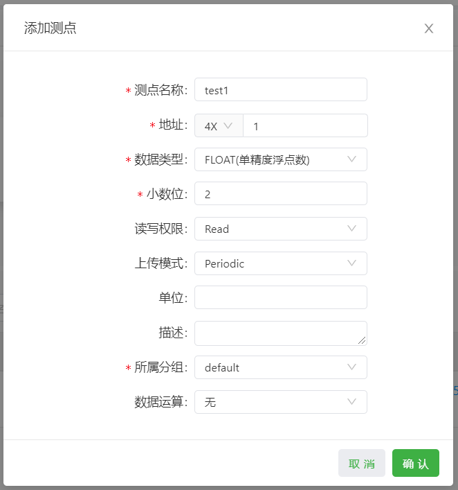
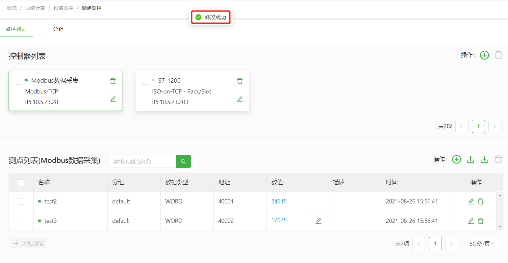
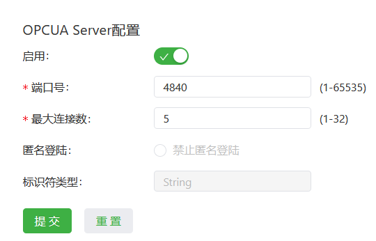

# DeviceSupervisor Agent 用户手册（DS 2.0）
DeviceSupervisor Agent（以下简称DeviceSupervisor）为用户提供了便捷的数据采集、数据处理、数据上云和协议转换功能，支持ISO on TCP、ModbusRTU等多种工业协议解析。版本号为**1.2.X**的DeviceSupervisor简称为**DS 1.0**，版本号为**2.X.X**的 DeviceSupervisor简称为**DS 2.0**。
本手册以采集PLC的数据并上传至EMQX的在线MQTT服务器为例说明DS 2.0如何通过DeviceSupervisor实现PLC数据采集和数据上云。以下将InGateway902简称为“IG902”；InGateway502简称为“IG502”；InGateway974简称为“IG974”。

  - [概览](#overview)
  - [1.准备硬件设备及其数据采集环境](#prepare-hardware-equipment-and-its-data-collection-environment)
    - [1.1 硬件接线](#hardware-wiring)
      - [1.1.1 以太网接线](#ethernet-wiring)
      - [1.1.2 串口接线](#serial-wiring)
    - [1.2 设置InGateway访问PLC](#set-lan-network-parameters)
    - [1.3 设置InGateway联网](#set-wan-network-parameters)
    - [1.4 更新InGateway设备软件版本](#update-ingateway-device-software-version)
  - [2.DeviceSupervisor数据采集配置](#configuration_device_supervisor_app)
    - [2.1 安装并运行DeviceSupervisor](#install_and_run_device_supervisor)
    - [2.2 数据采集配置](#device_supervisor-data-acquisition-configuration)
      - [2.2.1 添加控制器](#add-plc-device)
      - [2.2.2 添加测点](#add-variables)
      - [2.2.3 配置告警规则](#configure-alarm-strategy)
      - [2.2.4 配置分组](#configure-group)
  - [3.上报和监控PLC数据](#monitor-plc-data)
    - [3.1 本地监控PLC数据](#local-monitor-plc-data)
      - [3.1.1 本地监控数据采集](#local-monitoring-data-collection)
      - [3.1.2 本地监控告警](#local-monitoring-alarm)
    - [3.2 云平台监控PLC数据](#monitor-plc-data-on-cloud)
    - [3.3 远端SCADA数据监控](#scada-monitor-plc-data)
      - [3.3.1 配置协议转换Slave/Server](#configure-protocol-conversion-slave)
      - [3.3.2 配置映射表](#configuration-mapping-table)
    - [3.4 数据边缘处理](#data-edge-processing)
  - [附录](#appendix)
    - [导入导出数据采集配置](#import-and-export-configuration)
    - [消息管理（自定义MQTT发布/订阅）](#custom-mqtt-publish-and-subscribe)
      - [配置发布消息](#publish)
      - [配置订阅消息](#subscribe)
      - [Device Supervisor的api接口说明](#device_supervisor_api_description)
      - [Device Supervisor的回调函数说明](#callback-function-description)
    - [参数设置](#parameter-settings)
    - [网关的其他配置](#other-configuration)
  - [FAQ](#faq)
    - [查看云服务脚本是否正确](#check-if-the-cloud-service-script-correct)
    - [查看App的云服务输出是否正确](#check-if-the-app-cloud-service-output-correct)


<a id="overview"> </a>  

## 概览
使用过程中，您需要准备以下项：  
- 边缘计算网关IG502/IG902/IG974  
- PLC设备  
- 网线/串口线  
- *更新软件版本所需的固件、SDK和App  
  - 固件版本
    - IG502：V2.0.0.r14045
    - IG902：V2.0.0.r14047
    - IG974：V2.0.0.r14106
  - SDK版本：py3sdk-V1.4.5及以上
  - App版本：2.2.0及以上  

整体流程如下图所示：  


<a id="prepare-hardware-equipment-and-its-data-collection-environment"> </a>  

## 1.准备硬件设备及其数据采集环境

  - [1.1 硬件接线](#hardware-wiring)
  - [1.2 设置InGateway访问PLC](#set-lan-network-parameters)
  - [1.3 设置InGateway联网](#set-wan-network-parameters)
  - [1.4 更新InGateway设备软件版本](#update-ingateway-device-software-version)

<a id="hardware-wiring"> </a>  

### 1.1 硬件接线

  - [1.1.1 以太网接线](#ethernet-wiring)
  - [1.1.2 串口接线](#serial-wiring)

<a id="ethernet-wiring"> </a>  

#### 1.1.1 以太网接线
- IG902以太网接线  
  
  接通IG902的电源并按照拓扑使用以太网线连接IG902和PLC。  

    

- IG974以太网接线  
  
  接通IG974的电源并按照拓扑使用以太网线连接IG974和PLC。  

   

- IG502以太网接线  
  
  接通IG502的电源并按照拓扑使用以太网线连接IG502和PLC。  

  

<a id="serial-wiring"> </a>  

#### 1.1.2 串口接线
- IG902串口接线  

  接通IG902的电源并按照拓扑连接IG902和PLC。  

    

  IG902串口端子接线说明如下图：  

    

- IG974串口接线  

  接通IG974的电源并按照拓扑连接IG974和PLC。  

    

  IG974串口端子接线说明如下图：  

  

- IG502串口接线  

  接通IG502的电源并按照拓扑连接IG502和PLC。  

    

  IG502串口端子接线说明如下图：  

  

<a id="set-lan-network-parameters"> </a>  

### 1.2 设置InGateway访问PLC
- IG902的GE 0/2口的默认IP地址为`192.168.2.1`。为了使IG902能够通过GE 0/2口访问以太网PLC，需要设置GE 0/2口与PLC处于同一网段，设置方法请参考[访问IG902](http://manual.ig.inhand.com.cn/zh_CN/latest/IG902-Quick-Start-Manual-CN.html#set-lan-parameters)。
- IG974的LAN口的默认IP地址为`192.168.2.1`。为了使IG902能够通过LAN口访问以太网PLC，需要设置LAN口与PLC处于同一网段，设置方法请参考[访问IG974](http://manual.ig.inhand.com.cn/zh_CN/latest/IG974-Quick-Start-Manual-CN.html#set-lan-parameters)。
- IG502的LAN口的默认IP地址为`192.168.2.1`。为了使IG502能够通过LAN口访问以太网PLC，需要设置LAN口与PLC处于同一网段，设置方法请参考[访问IG502](http://manual.ig.inhand.com.cn/zh_CN/latest/IG502-Quick-Start-Manual-CN.html#set-lan-parameters)。

<a id="set-wan-network-parameters"> </a>  

### 1.3 设置InGateway联网
- 设置IG902联网请参考[IG902连接Internet](http://manual.ig.inhand.com.cn/zh_CN/latest/IG902-Quick-Start-Manual-CN.html#set-wan-parameters)。
- 设置IG974联网请参考[IG974连接Internet](http://manual.ig.inhand.com.cn/zh_CN/latest/IG974-Quick-Start-Manual-CN.html#set-wan-parameters)。
- 设置IG502联网请参考[IG502连接Internet](http://manual.ig.inhand.com.cn/zh_CN/latest/IG502-Quick-Start-Manual-CN.html#set-wan-parameters)。

<a id="update-ingateway-device-software-version"> </a>  

### 1.4 更新InGateway设备软件版本
如需获取InGateway产品最新软件版本及其功能特性信息，请访问[资源中心](https://www.inhand.com.cn/downlist/edge-computing-gateway/)。如需更新软件版本，请参考如下链接：
- [更新IG902软件版本](http://manual.ig.inhand.com.cn/zh_CN/latest/IG902-Quick-Start-Manual-CN.html#update-the-software)  
  
  使用DeviceSupervisor时，IG902的固件版本应为`V2.0.0.r14047`及以上；SDK版本应为`py3sdk-V1.4.5`及以上。
- [更新IG974软件版本](http://manual.ig.inhand.com.cn/zh_CN/latest/IG974-Quick-Start-Manual-CN.html#update-the-software)  
  
  使用DeviceSupervisor时，IG974的固件版本应为`V2.0.0.r14106`及以上；SDK版本应为`py3sdk-V1.4.5`及以上。
- [更新IG502软件版本](http://manual.ig.inhand.com.cn/zh_CN/latest/IG502-Quick-Start-Manual-CN.html#update-the-software)  

  使用DeviceSupervisor时，IG502的固件版本应为`V2.0.0.r14045`及以上；SDK版本应为`py3sdk-V1.4.5`及以上。

<a id="configuration_device_supervisor_app"> </a>  

## 2.DeviceSupervisor数据采集配置

  - [2.1 安装并运行DeviceSupervisor](#install_and_run_device_supervisor)
  - [2.2 数据采集配置](#device_supervisor-data-acquisition-configuration)


<a id="install_and_run_device_supervisor"> </a>  

### 2.1 安装并运行DeviceSupervisor
- IG902如何安装并运行Python App请参考[IG902安装和运行Python App](http://manual.ig.inhand.com.cn/zh_CN/latest/IG902-Quick-Start-Manual-CN.html#install-and-run-python-app)，下载DeviceSupervisor请访问[资源中心](https://www.inhand.com.cn/downlist/edge-computing-gateway/)。DeviceSupervisor正常运行后如下图所示：  
  
    

- IG974如何安装并运行Python App请参考[IG974安装和运行Python App](http://manual.ig.inhand.com.cn/zh_CN/latest/IG974-Quick-Start-Manual-CN.html#install-and-run-python-app)，下载DeviceSupervisor请访问[资源中心](https://www.inhand.com.cn/downlist/edge-computing-gateway/)。DeviceSupervisor正常运行后如下图所示：  
  
    

- IG502如何安装并运行Python App请参考[IG502安装和运行Python App](http://manual.ig.inhand.com.cn/zh_CN/latest/IG502-Quick-Start-Manual-CN.html#install-and-run-python-app)，下载DeviceSupervisor请访问[资源中心](https://www.inhand.com.cn/downlist/edge-computing-gateway/)。DeviceSupervisor正常运行后如下图所示：  
  
      

<a id="device_supervisor-data-acquisition-configuration"> </a>  

### 2.2 数据采集配置

  - [2.2.1 添加控制器](#add-plc-device)
  - [2.2.2 添加测点](#add-variables)
  - [2.2.3 配置告警规则](#configure-alarm-strategy)
  - [2.2.4 配置分组](#configure-group)

<a id="add-plc-device"> </a>  

#### 2.2.1 添加控制器
- 添加以太网控制器（以ISO on TCP协议为例） 
  
  进入“边缘计算 > 设备监控 > 测点监控”页面，点击“添加”按钮，在添加控制器页面选择控制器协议为“ISO on TCP”并配置控制器的通讯参数，轮询间隔为采集数据的时间间隔。<font color=#FF0000>注意：控制器名称不能重复。</font>  
  
  下图是添加S7-1500、S7-1200、S7-400和S7-300系列PLC的示例（模式选择`Rack/Slot`）。机架号和槽号默认使用0即可：

    

  下图是添加S7-200、S7-200 Smart和西门子LOGO系列PLC的示例（模式选择`TSAP`）。<font color=#FF0000>注意：添加S7-200 Smart时，客户端TSAP配置为02.00，服务端TSAP配置为02.01；其余系列根据实际情况配置。</font>

  

  添加成功后如下图所示：  

    

- 添加串口控制器（以ModbusRTU协议为例）
  
  进入“边缘计算 > 设备监控 > 测点监控”页面，点击“添加”按钮，在添加控制器页面选择控制器协议为“ModbusRTU”并配置控制器的通讯参数，轮询间隔为采集数据的时间间隔。<font color=#FF0000>注意：控制器名称不能重复。</font> 

    

  添加成功后如下图所示：  

    

  如需修改RS232/RS485串口的通讯参数，请在“边缘计算 > 设备监控 > 参数设置”页面修改。修改后所有串口设备的通讯参数将自动修改并按照修改后的通讯参数通讯。  

  


<a id="add-variables"> </a>  

#### 2.2.2 添加测点
- 添加ISO on TCP测点  
  
  在“测点监控”页面点击“添加测点”按钮，在弹出框中配置测点参数：
  - `测点名称`：测点的名称<font color=#FF0000>（同一控制器测点名称不能重复）</font>    
  - `地址类型`：测点地址类型，包括`I/Q/M/DB`四种类型  
  - `DB索引`：地址类型为DB时测点的DB号  
  - `地址`：测点地址  
  - `数据类型`：测点数据类型，包括：   
    - `BIT`：0或1  
    - `BYTE`：8位无符号数据  
    - `SINT`：8位有符号数据  
    - `WORD`：16位无符号数据  
    - `INT`：16位有符号数据  
    - `DWORD`：32位无符号数据  
    - `DINT`：32位有符号数据  
    - `FLOAT`：32位浮点数  
    - `STRING`：8位字符串  
    - `BCD`：16位BCD码  
  - `小数位`：数据类型为FLOAT时测点小数点后的数据长度，最大6位  
  - `长度`：数据类型为STRING时字符串长度，读取1个字符串的长度为1  
  - `位`：数据类型为BIT时测点的位偏移，可输入0~7中任一数字  
  - `读写权限`：  
    - `Read`：只读，不可写  
    - `Read/Write`：可读可写  
  - `上传模式`：  
    - `Periodic`：按照所属分组的上报周期定时上报数据  
    - `Onchange`：测点数值有变化时才按照分组的上报周期定时上报数据  
    - `Never`：仅在本地使用，不需要上传云端的数据
  - `单位`：测点单位  
  - `描述`：测点描述  
  - `所属分组`：测点所属分组  
  - `数据运算`：测点数据类型非`BIT`和`STRING`型时支持通过数据运算进行简单的运算处理，处理后的数据值可以上报至云平台。<font color=#FF0000>映射到协议转换中（Modbus Slave或OPCUA Server等）的数值为采集的原始数据值而不是运算后的数据值</font>
    - `无`：不进行运算，使用采集的原始数据值
    - `比例运算`：将采集的数据值按数据上下限范围等比例映射到比例上下限范围中的某个数据值，如将传感器中采集到的数据映射为实际的温湿度。计算公式为`计算后的数据值=（比例上限-比例下限）/（数据上限-数据下限）*（原始数据值-数据下限）+比例下限`
      - `数据上限`：测点的数据上限值
      - `数据下限`：测点的数据下限值
      - `比例上限`：比例运算后的数据上限值
      - `比例下限`：比例运算后的数据下限值
    - `偏移及缩放`：按照倍率和偏移量计算原始数据值，公式为`计算后的数据值=（原始数据值*倍率）+偏移量`
      - `倍率`：需要放大或缩小的倍率
      - `偏移量`：倍率运算后需要增加或减少的数据值
    - `位截取`：截取原始数据中的一段位数据作为数据值。`FLOAT`型测点不支持此操作
      - `起始位`：开始截取原始数据的位偏移
      - `结束位`：结束截取原始数据的位偏移
  - `数值映射`：启用后将BIT型测点的0和1值映射为False和True
  
  下图是添加一个地址为%I0.0的开关测点的例子：  

    

  下图是添加一个地址为%IB1的字节测点的例子：  
  
    

  下图是添加一个地址为%IW3的字测点的例子：  
  
    

  下图是添加一个地址为%ID4的双字测点的例子：  
  
    

  下图是添加一个地址为%DB6.DBD18的浮点数测点的例子：  
  
    

- 添加Modbus测点  
  
  在“测点监控”页面点击“添加测点”按钮，在弹出框中配置测点参数：
  - `测点名称`：测点的名称<font color=#FF0000>（同一控制器下测点名称不能重复）</font>    
  - `地址`：测点的寄存器地址  
  - `数据类型`：测点数据类型，包括：  
    - `BIT`：0或1  
    - `WORD`：16位无符号数据  
    - `INT`：16位有符号数据  
    - `DWORD`：32位无符号数据  
    - `DINT`：32位有符号数据  
    - `FLOAT`：32位浮点数  
    - `STRING`：8位字符串   
  - `小数位`：数据类型为FLOAT时测点小数点后的数据长度，最大6位  
  - `长度`：数据类型为STRING时字符串长度  
  - `位`：地址为`300001~365535`，`400001~~465535`且数据类型为BIT时测点的位偏移，可输入0~15中任一数字  
  - `读写权限`：  
    - `Read`：只读，不可写  
    - `Read/Write`：可读可写  
  - `上传模式`：  
    - `Periodic`：按照所属分组的上报周期定时上报数据  
    - `Onchange`：测点数值有变化时才按照分组的上报周期定时上报数据  
    - `Never`：仅在本地使用，不需要上传云端的数据
  - `单位`：测点单位  
  - `描述`：测点描述  
  - `所属分组`：测点所属分组  
  - `数据运算`：测点数据类型非`BIT`和`STRING`型时支持通过数据运算进行简单的运算处理，处理后的数据值可以上报至云平台。<font color=#FF0000>映射到协议转换中（Modbus Slave或OPCUA Server等）的数值为采集的原始数据值而不是运算后的数据值</font>
    - `无`：不进行运算，使用采集的原始数据值
    - `比例运算`：将采集的数据值按数据上下限范围等比例映射到比例上下限范围中的某个数据值，如将传感器中采集到的数据映射为实际的温湿度。计算公式为`计算后的数据值=（比例上限-比例下限）/（数据上限-数据下限）*（原始数据值-数据下限）+比例下限`
      - `数据上限`：测点的数据上限值
      - `数据下限`：测点的数据下限值
      - `比例上限`：比例运算后的数据上限值
      - `比例下限`：比例运算后的数据下限值
    - `偏移及缩放`：按照倍率和偏移量计算原始数据值，公式为`计算后的数据值=（原始数据值*倍率）+偏移量`
      - `倍率`：需要放大或缩小的倍率
      - `偏移量`：倍率运算后需要增加或减少的数据值
    - `位截取`：截取原始数据中的一段位数据作为数据值。`FLOAT`型测点不支持此操作
      - `起始位`：开始截取原始数据的位偏移
      - `结束位`：结束截取原始数据的位偏移
  - `数值映射`：启用后将BIT型测点的0和1值映射为False和True

  下图是添加一个地址为00001的线圈测点的例子：  
  
    

  下图是添加一个地址为10001的开关测点的例子：  
  
    

  下图是添加一个地址为30001的整数测点的例子：  
  
    

  下图是添加一个地址为40001的浮点数测点的例子：  
  
   

<a id="configure-alarm-strategy"> </a>

#### 2.2.3 配置告警规则

你可以进入“边缘计算 > 设备监控 > 告警 > 告警规则”页面配置告警规则，点击“添加”按钮后，在弹出框中配置告警规则参数。参数如下：

- `名称`：告警名称
- `控制器`：告警测点所属控制器 
- `测点名称`：触发告警的测点名称
- `告警等级`：从低到高分别支持“提醒”、“警告”、“次要”、“重要”、“严重”
- `告警条件`
  - `判断条件`：支持“=”、“!=”、“>”、“≥”、“<”、“≤”
  - `逻辑条件`
    - `无逻辑条件`：仅通过单个判断条件判断告警
    - `&&`：通过两个判断条件相与判断告警
    - `||`：通过两个判断条件相或判断告警
- `告警内容`：告警内容
- `告警标签`：告警标签用于为告警分类，方便告警上云时快速选择

下图是一条告警等级为提醒的告警。该告警在测点数值>30且<50时产生告警；不在此范围时不产生告警或告警消除。  

  

<a id="configure-group"> </a>  

#### 2.2.4 配置分组
如需为测点配置不同的上报间隔或需要按照不同的MQTT主题上报相应的测点数据时，可在“边缘计算 > 设备监控 > 测点监控 > 分组”页面添加新分组。  


  
下图添加了一个名为“group2”的分组，该分组每30秒上报一次分组中的测点：  

  

添加分组后，添加测点时可以选择将测点关联到该分组或者在测点列表中选择测点添加到指定分组中。分组中的测点会按照分组的上报间隔上报数据。  

  


<a id="monitor-plc-data"> </a>  

## 3.上报和监控PLC数据 

  - [3.1 本地监控PLC数据](#local-monitor-plc-data)
  - [3.2 云平台监控PLC数据](#monitor-plc-data-on-cloud)

<a id="local-monitor-plc-data"> </a>  

### 3.1 本地监控PLC数据

  - [3.1.1 本地监控数据采集](#local-monitoring-data-collection)
  - [3.1.2 本地监控告警](#local-monitoring-alarm)

<a id="local-monitoring-data-collection"> </a>  

#### 3.1.1 本地监控数据采集
数据采集配置完成后，可以在“边缘计算 > 设备监控 > 测点监控”页面查看数据采集情况。点击控制器列表中的控制器卡片可切换需要查看的PLC数据。  

 

点击数值栏的按钮可进行写入操作。  

  

 

修改成功如下图所示：  



<a id="local-monitoring-alarm"> </a>  

#### 3.1.2 本地监控告警
告警策略配置完成后，可以在“边缘计算 > 设备监控 > 告警”页面查看测点告警情况。
- 实时告警：查看当前未消除的告警信息

    
  
- 历史告警：筛选查看任意告警信息
  
    
  

<a id="monitor-plc-data-on-cloud"> </a>  

### 3.2 云平台监控PLC数据
进入“边缘计算 > 设备监控 > 云服务”页面，勾选启用云服务并配置相应的MQTT连接参数，配置完成后点击提交。
- `类型`：EMQX的在线MQTT服务器的连接方式为`标准MQTT`。`阿里云IoT`的使用方法请参考[阿里云IoT使用说明](http://app.ig.inhand.com.cn/zh_CN/latest/AliyunIoT-CN.html)；`AWS IoT`的使用方法请参考[AWS IoT使用说明](http://app.ig.inhand.com.cn/zh_CN/latest/AWSIoT-CN.html)；`Azure IoT`的使用方法请参考[Azure IoT使用说明](http://app.ig.inhand.com.cn/zh_CN/latest/AzureIoT-CN.html)
- `服务器地址`：MQTT服务器地址为`broker-cn.emqx.io`
- `MQTT客户端ID`：任一唯一ID。<font color=#FF0000>支持调用自定义参数设置客户端ID，如配置客户端ID为“${SN}”</font>
- 其余项使用默认配置即可  

配置完成后如下图所示：  


提交后在“消息管理”中配置发布和订阅消息，已缓存的历史数据不需要上报时，可点击“清空离线缓存”清除已缓存的历史数据。发布和订阅消息的配置方法请参考[消息管理（自定义MQTT发布/订阅）](#custom-mqtt-publish-and-subscribe)。以下是示例配置：
- 发布消息：
  - `名称`：任意不重复的名称
  - `数据源类型`：上报测点数据时选择`测点分组消息`；上报告警数据时选择`告警消息`。本示例使用`测点分组消息`
  - `Topic`：`devices/telemetry`
  - `Qos(MQTT)`：`1`
  - `分组`：需要上传数据至thingsboard的分组名称，本文档为`default`
  - `入口函数`：入口函数名称，本文档为`main`
  - `函数代码`：
    ```python
    import json
    from common.Logger import logger
    from quickfaas.remotebus import publish
    from datetime import datetime
    
    def main(message, wizard_api): #定义发布入口函数
        value_list = [] #定义数据列表
        for device, val_dict in message['values'].items(): #遍历values字典，该字典中包含设备名称和设备下的变量数据
            value_dict = { #自定义数据格式
                          "Device": device,
                          "timestamp": message["timestamp"],
                          "Data": {}
                          }
            for id, val in val_dict.items(): #遍历变量数据，为数据字典赋值
                value_dict["Data"][id] = val["raw_data"]
            value_list.append(value_dict) #依次将value_dict添加到value_list中
        logger.info(value_list) 
        publish(__topic__, json.dumps(value_list), __qos__) #使用发布消息中定义的主题和qos发送value_list至云平台。当qos不为0时，数据发送失败则缓存数据等待连接恢复后按先存先传的顺序上传至MQTT服务器
    ```
  配置完成后如下图所示：  

  

- 订阅消息:
  - `名称`：任意不重复的名称
  - `Topic`：`devices/rpc/request`
  - `Qos(MQTT)`：`1`
  - `入口函数`：入口函数名称，本文档为`main`
  - `Payload类型`：负载类型，本文档为`JSON`
  - `函数代码`：
    ```python
    from quickfaas.measure import write_plc_values
    from common.Logger import logger
    import json
      
    def main(topic, payload): #定义订阅入口函数
        logger.info("topic: %s, payload: %s" %(topic, payload)) #打印订阅主题和数据,假定payload数据为{"method":"setValue","Device":"Modbus_test", "TagName":"SP1", "TagValue":12.3}
        payload = json.loads(payload) #反序列化订阅数据
        if payload["method"] == "setValue": #检测是否为写入数据
            message = {payload["Device"]: {payload["TagName"]:payload["TagValue"]}} #定义下发消息，包括下发的变量名称和变量值
            write_plc_values(message) # 写入数据    
    ```

  配置完成后如下图所示：  

  

<a id="scada-monitor-plc-data"> </a>  

### 3.3 远端SCADA数据监控

  - [3.3.1 配置协议转换Slave/Server](#configure-protocol-conversion-slave)
  - [3.3.2 配置映射表](#configuration-mapping-table)

<a id="configure-protocol-conversion-slave"> </a>  

#### 3.3.1 配置协议转换Slave/Server
- 配置Modbus Slave  
  
  进入“协议转换 > Modbus Slave”页面，点击“启用” Modbus TCP Slave。启用后，配置相应的通讯参数，示例如下：  

  

- 配置IEC104 Server
  
  进入“协议转换 > IEC104 Server”页面，点击“启用” IEC104 Server。启用后，配置相应的通讯参数，示例如下：  

  

- 配置OPCUA Server
  
  进入“协议转换 > OPCUA Server”页面，点击“启用” OPCUA Server。启用后，配置相应的通讯参数，示例如下：  

  

<a id="configuration-mapping-table"> </a>  

#### 3.3.2 配置映射表
- 配置Modbus映射表  

  以添加单个Modbus映射为例，点击“添加”按钮，在弹出框中选择相应的测点并设置映射地址，示例如下：  

    

- 配置IEC104映射表

  以添加单个IEC104映射为例，点击“添加”按钮，在弹出框中选择相应的测点并设置映射地址，示例如下：  

   

- 配置OPCUA映射表

  以添加单个OPCUA映射为例，点击“添加”按钮，在弹出框中选择相应的测点即可，示例如下：  

   

<a id="data-edge-processing"> </a> 

### 3.4 数据边缘处理
简单的数据处理可以在“添加测点”时通过配置“数据运算”功能解决，如需进行复杂的业务数据处理则可以通过“自定义快函数”解决。  
进入“边缘计算 > 设备监控 > 自定义快函数”页面，点击“添加”按钮，在弹出框中配置业务逻辑： 
- `名称`：快函数名称，名称不能重复。
- `模式`：支持两种模式
  - `周期触发`：按照时间周期性触发快函数
  - `本地订阅消息触发`：网关本地的MQTT服务器接收到指定topic的消息后触发执行快函数
- `周期`：模式为“周期触发”时的触发间隔
- `订阅Topic`：模式为“本地订阅消息触发”时，触发执行快函数的topic
- `入口函数`：入口函数名称
- `函数代码`：使用Python代码编写的业务逻辑

示例配置如下： 


<a id="appendix"> </a>  

## 附录

  - [导入导出数据采集配置](#import-and-export-configuration)
  - [消息管理（自定义MQTT发布/订阅）](#custom-mqtt-publish-and-subscribe)
  - [参数设置](#parameter-settings)
  - [网关的其他配置](#other-configuration)

<a id="import-and-export-configuration"> </a>  

### 导入导出数据采集配置
DeviceSupervisor支持导入导出部分CSV格式的配置文件，您可以通过导入导出配置文件快速实现采集配置。各配置文件内容如下：

- `measure.csv`:测点配置文件，详细参数如下
  - `MeasuringPointName`：测点名称
  - `ControllerName`：测点所属设备
  - `GroupName`：测点所属分组 
  - `UploadType`：上传模式，包括`realtime`、`onchange`、`never`
  - `Data Type`：数据类型
  - `Address`：测点地址
  - `Decimal`：小数位，`1~6`
  - `Len`：字符串长度
  - `ReadWrite`：读写权限，包括`Read/Write`、`Read`
  - `Unit`：单位
  - `Description`：描述
  - `Transform Type`：数据运算类型，包括`gain`（比例换算）、`zoom`（偏移及缩放）、`bit`（位截取）、`none`（无）
  - `MaxValue`：`Transform Type`为`gain`时有效，测点的数据上限值
  - `MinValue`：`Transform Type`为`gain`时有效，测点的数据下限值
  - `MaxScale`：`Transform Type`为`gain`时有效，比例运算后的数据上限值
  - `MinScale`：`Transform Type`为`gain`时有效，比例运算后的数据下限值
  - `Gain`：`Transform Type`为`zoom`时有效，需要放大或缩小的倍率
  - `Offset`：`Transform Type`为`zoom`时有效，倍率运算后需要增加或减少的数据值
  - `startBit`：`Transform Type`为`bit`时有效，开始截取原始数据的位偏移
  - `endBit`：`Transform Type`为`bit`时有效，结束截取原始数据的位偏移
  - `bitMap`：仅对`BIT`类型测点生效，为`1`时将BIT型测点的0和1值映射为False和True

  导出方式为监控列表页面的测点列表导出。  

    

  示例配置如下：  

    
  
- `group.csv`:分组配置文件，详细参数如下
  - `GroupName`：分组名称
  - `UploadInterval`：上报周期

  导出方式为分组页面的分组导出。  

    

  示例配置如下：  

    

- `alarm.csv`：告警规则配置文件，详细参数如下：
  - `AlarmName`：告警名称
  - `ControllerName`：告警测点所属控制器
  - `MeasuringPointName`：引用的测点名称
  - `AlarmLevel`：告警等级。1：提醒，2：警告，3：次要，4：重要，5：严重
  - `Condition1`：告警条件1。Eq：等于,Neq：不等于,Gt：大于,Gne：大于等于,Lne：小于等于,Lt：小于
  - `Operand1`：告警阈值1
  - `CombineMethod`：告警条件连接方式。None：空，And：&&，Or：||
  - `Condition2`：告警条件2
  - `Operand2`：告警阈值2
  - `AlarmContent`：告警内容
  - `AlarmTag`：告警标签

  导出方式为告警策略页面的告警导出。

  

<a id="custom-mqtt-publish-and-subscribe"> </a>  

### 消息管理（自定义MQTT发布/订阅）
您可以在“边缘计算 > 设备监控 > 云服务”配置你的MQTT连接参数，通过消息管理功能配置上报数据的MQTT主题、数据来源等参数并支持使用Python语言自定义MQTT发布和订阅消息的数据上报、处理等逻辑。无需二次开发即可实现与多种MQTT服务器进行数据上传和下发。以下将为您说明“消息管理”的使用方法。  

  - [配置发布消息](#publish)
  - [配置订阅消息](#subscribe)
  - [DeviceSupervisor的api接口说明](#device_supervisor_api_description)
  - [DeviceSupervisor的回调函数说明](#callback-function-description)

<a id="publish"> </a>  

#### 配置发布消息
自定义发布消息中包含以下配置项：
- `名称`：用户自定义发布名称
- `数据源类型`：需要发布的数据类型
  - `测点数据`：发布指定分组下的测点数据
  - `告警数据`：发布指定告警标签下的告警数据
- `分组/告警标签`：
  - `分组`：选择相应的分组后，分组下所有测点通过该发布配置将数据上传至MQTT服务器。可选择多个分组，当选择多个分组时，按照分组的上报周期分别对各分组下的测点执行发布中的脚本逻辑。<font color=#FF0000>分组中必须包含测点，否则不会执行发布中的脚本逻辑</font>
  - `告警标签`：选择相应的告警标签后，告警标签下所有告警通过该发布配置将数据上传至MQTT服务器，可选择多个告警标签。<font color=#FF0000>告警触发后立即上报</font>
- `Topic`：发布主题，与MQTT服务器订阅的主题保持一致
- `Qos(MQTT)`：发布Qos，建议与MQTT服务器的Qos保持一致
  - `0`：只发送一次消息，不进行重试  
  - `1`：最少发送一次消息，确保消息到达MQTT服务器
  - `2`：确保消息到达MQTT服务器且只收到一次
- `入口函数`：入口函数名称，与函数代码中的入口函数名称保持一致
- `函数代码`：使用Python代码自定义组包和处理逻辑，发布中的入口函数参数包括：
  - `参数1`：DeviceSupervisor将采集后的测点/告警数据发送给该参数，数据格式如下：  
    - 测点数据格式：
      ```python
      {
          'timestamp': 1589434519.5458372,  #数据产生时间戳
          'group_name': 'default',  #采集组名称
          'values':  #变量数据字典，包含PLC名称，变量名称和变量值
          {
              'S7-1200':  #PLC名称
              {
                  'Test1':  #变量名称
                  {
                      'raw_data': False,  #变量值
                      'status': 1  #采集状态，非1即采集异常
                  },
                  'Test2':
                  {
                      'raw_data': 2,
                      'status': 1
                  }
              }
          }
      }
      ```

    - 告警数据格式：  
      ```python
      {
      	'timestamp': 1641975441,  #告警产生时间戳
      	'group_name': 'default',  #告警组名称
      	'values': {  #告警数据字典，包含告警名称等告警信息
      		'Warn': {  #告警名称
      			'ctrlName': 'S71200',  #告警控制器名称
      			'measureName': 'DATA2',  #告警测点名称
      			'timestamp': 1641975441,  #告警产生时间戳
      			'current': 'on',  #告警状态。on:已触发，off:已消除
      			'status': 0,  #告警状态。0:已触发，1:已消除
      			'value': 1,  #告警触发时告警变量的数值
      			'alarm_content': 'Test',  #告警描述
      			'level': 1  #预留字段
      		}
      	}
      }
      ```
  - `参数2`：兼容`DS 1.0`版本Device Supervisor提供的api接口。<font color=#FF0000>不兼容`save_data` api接口。脚本中需要提供此参数，否则会影响`参数1`的格式</font>

以下是常见的自定义发布方法示例：

<a id="pub-example1"> </a>

- 发布示例1：使用`publish`上传测点数据  

  本示例实现了使用`publish`上传测点数据，将处理后的测点数据使用publish命令上传至MQTT服务器。当qos不为0时，如果发送失败则缓存测点数据并等待MQTT连接正常后按先存先传的顺序上传至MQTT服务器。发布和代码配置示例如下：  

    

  ```python
  import json
  from common.Logger import logger
  from quickfaas.remotebus import publish
  from datetime import datetime
  
  def main(message, wizard_api): #定义发布入口函数
      value_list = [] #定义数据列表
      for device, val_dict in message['values'].items(): #遍历values字典，该字典中包含设备名称和设备下的变量数据
          value_dict = { #自定义数据格式
                        "Device": device,
                        "timestamp": message["timestamp"],
                        "Data": {}
                        }
          for id, val in val_dict.items(): #遍历变量数据，为数据字典赋值
              value_dict["Data"][id] = val["raw_data"]
          value_list.append(value_dict) #依次将value_dict添加到value_list中
      logger.info(value_list) 
      publish(__topic__, json.dumps(value_list), __qos__) #使用发布消息中定义的主题和qos发送value_list至云平台。当qos不为0时，数据发送失败则缓存数据等待连接恢复后按先存先传的顺序上传至MQTT服务器
  ```

<a id="pub-example2"> </a>

- 发布示例2：使用`publish`上传告警数据

  本示例实现了使用`publish`上传告警数据，将处理后的告警数据使用publish命令上传至MQTT服务器。当qos不为0时，如果发送失败则缓存告警数据并等待MQTT连接正常后按先存先传的顺序上传至MQTT服务器。发布和代码配置示例如下：  

    

  ```python
  import json
  from common.Logger import logger
  from quickfaas.remotebus import publish
  
  
  def main(message, wizard_api): #定义发布入口函数
      logger.info(message) #打印告警数据
      publish(__topic__, json.dumps(message), __qos__) #使用发布消息中定义的主题和qos发送message至云平台。当qos不为0时，数据发送失败则缓存数据等待连接恢复后按先存先传的顺序上传至MQTT服务器
  ```

<a id="pub-example3"> </a>

- 发布示例3：使用`publish`上传测点数据并使用新的topic上报历史数据

  本示例实现了使用`publish`上传测点数据，将处理后的测点数据使用publish命令上传至MQTT服务器。如果发送失败则缓存测点数据并等待MQTT连接正常后使用历史数据的topic上传至MQTT服务器。发布和代码配置示例如下：  

    

  ```python
  import json
  from common.Logger import logger
  from quickfaas.remotebus import publish
  from datetime import datetime
  
  def main(message, wizard_api): #定义发布入口函数
      value_list = [] #定义数据列表
      for device, val_dict in message['values'].items(): #遍历values字典，该字典中包含设备名称和设备下的变量数据
          value_dict = { #自定义数据格式
                        "Device": device,
                        "timestamp": message["timestamp"],
                        "Data": {}
                        }
          for id, val in val_dict.items(): #遍历变量数据，为数据字典赋值
              value_dict["Data"][id] = val["raw_data"]
          value_list.append(value_dict) #依次将value_dict添加到value_list中
      wizard_data = {"topic": "devices/telemetry/history", "qos": 1, "payload": json.dumps(value_list)} #定义历史数据重发信息
      publish(__topic__, json.dumps(value_list), __qos__, wizard_data = wizard_data) #使用发布消息中定义的主题和qos发送value_list至云平台。当qos不为0时，数据发送失败则缓存数据等待连接恢复后按采集时间顺序上传至MQTT服务器。上报历史数据时按照wizard_data定义的topic、qos和负载上报
  ```

<a id="pub-example4"> </a>

- 发布示例4：使用`get`获取DeviceSupervisor配置信息
  
  本示例实现了每次重启DeviceSupervisor时使用get方法获取控制器、测点和告警配置并分别上传至MQTT服务器。发布和代码配置示例如下：

  

  ```python
  import json
  from common.Logger import logger
  from quickfaas.remotebus import publish
  from quickfaas.config import get
  
  IS_UPLOAD_CONFIG = True  #定义变量用于判断是否需要获取并上传配置
  
  def main(message, wizard_api):  #定义发布主函数
      global IS_UPLOAD_CONFIG  #声明变量为全局变量
      if IS_UPLOAD_CONFIG:  #判断是否需要获取并上传配置
          config = get()  #调用get方法获取配置
          IS_UPLOAD_CONFIG = False  #获取并上传点表后不再上传点表
  
          controller_topic = "Config/ControllerInfo"  #定义控制器发布主题
          measure_topic = "Config/MeasureInfo"  #定义测点发布主题
          alarm_topic = "Config/AlarmInfo"  #定义告警发布主题
      
          controller_config = config["controllers"]  #定义需要发布的控制器配置信息
          measure_config = config["measures"]  #定义需要发布的测点配置信息
          alarm_config = config["alarms"]  #定义需要发布的告警配置信息
      
          publish(controller_topic, controller_config, 1)  #发布的控制器配置
          publish(measure_topic, measure_config, 1)  #发布的测点配置
          publish(alarm_topic, alarm_config, 1)  #发布的告警配置
  ```

<a id="pub-example5"> </a>

- 发布示例5：使用`get_global_parameter`获取参数设置中的自定义参数

  本示例实现了获取“参数设置”中的自定义参数device_id，并通过通配符${device_id}的配置方式配置MQTT主题。发布和代码配置示例如下：

    

    

  ```python
  import json
  from common.Logger import logger
  from quickfaas.remotebus import publish
  from quickfaas.global_dict import get_global_parameter
  
  def main(message, wizard_api): #定义发布主函数
      global_parameter = get_global_parameter() #定义自定义参数变量
      logger.info(global_parameter) #打印自定义参数变量
      value_list = [] #定义数据列表
      for device, val_dict in message['values'].items(): #遍历values字典，该字典中包含设备名称和设备下的变量数据
          value_dict = { #自定义数据字典
                        "Device": device,
                        "DeviceID": global_parameter["device_id"], #获取自定义参数中定义的设备ID
                        "timestamp": message["timestamp"],
                        "Data": {}
                        }
          for id, val in val_dict.items(): #遍历变量数据，为Data字典赋值
              value_dict["Data"][id] = val["raw_data"]
          value_list.append(value_dict) #依次将value_dict添加到value_list中
      logger.info(value_list) #在App日志中打印value_list，数据格式为[{'Device': 'S7-1200', 'DeviceID': '1', 'timestamp': 1589538347.5604711, 'Data': {'Test1': False, 'Test2': 12}}]
      publish(__topic__, json.dumps(value_list), __qos__) #使用发布消息中定义的主题和qos发送message至云平台。当qos不为0时，数据发送失败则缓存数据等待连接恢复后按先存先传的顺序上传至MQTT服务器
  ```

<a id="subscribe"> </a>  

#### 配置订阅消息
自定义订阅消息中包含以下项：
- `名称`：用户自定义订阅名称
- `Topic`：订阅主题，与MQTT服务器发布的数据主题保持一致
- `Qos(MQTT)`：订阅Qos，建议与MQTT服务器的Qos保持一致
- `入口函数`：入口函数名称，与函数代码中的入口函数名称保持一致
- `Payload类型`：Payload类型，与云平台要求的类型保持一致。通常为`JSON`
- `函数代码`：使用Python代码自定义组包和处理逻辑，订阅中的入口函数参数包括：
  - `参数1`：该参数为接收到的主题，数据类型为`string`
  - `参数2`：该参数为接收到的数据，数据类型为`string`
  - `参数3`：兼容`DS 1.0`版本Device Supervisor提供的api接口。<font color=#FF0000>不兼容`save_data` api接口</font>

以下是常见的自定义订阅方法示例：

<a id="sub-example1"> </a>

- 订阅示例1：下发测点名称和测点值写入PLC数据且不返回写入结果  

  本示例实现了从MQTT服务器下发指定命令修改测点数值，发布和代码配置示例如下：

    

  ```python
  from quickfaas.measure import write_plc_values
  from common.Logger import logger
  import json
    
  def main(topic, payload): #定义订阅入口函数
      logger.info("topic: %s, payload: %s" %(topic, payload)) #打印订阅主题和数据,假定payload数据为{"method":"setValue", "TagName":"SP1", "TagValue":12.3}
      payload = json.loads(payload) #反序列化订阅数据
      if payload["method"] == "setValue": #检测是否为写入数据
          message = {payload["TagName"]:payload["TagValue"]} #定义下发消息，包括下发的变量名称和变量值
          write_plc_values(message) # 写入数据
  ```

<a id="sub-example2"> </a>

- 订阅示例2：下发控制器名称，测点名称和测点值写入PLC数据且不返回写入结果 

  本示例实现了从MQTT服务器下发指定命令修改测点数值，发布和代码配置示例如下：

    

  ```python
  from quickfaas.measure import write_plc_values
  from common.Logger import logger
  import json
    
  def main(topic, payload): #定义订阅入口函数
      logger.info("topic: %s, payload: %s" %(topic, payload)) #打印订阅主题和数据,假定payload数据为{"method":"setValue","Device":"Modbus_test", "TagName":"SP1", "TagValue":12.3}
      payload = json.loads(payload) #反序列化订阅数据
      if payload["method"] == "setValue": #检测是否为写入数据
          message = {payload["Device"]: {payload["TagName"]:payload["TagValue"]}} #定义下发消息，包括下发的变量名称和变量值
          write_plc_values(message) # 写入数据
  ```

<a id="sub-example3"> </a>

- 订阅示例3：下发写入PLC数据且返回写入结果 

  本示例实现了从MQTT服务器下发指定命令修改测点数值并返回结果，发布和代码配置示例如下：

    

  ```python
  from quickfaas.measure import write_plc_values
  from quickfaas.remotebus import publish
  from common.Logger import logger
  import json
  
  def main(topic, payload): #定义订阅主函数
      logger.info("topic: %s, payload: %s" %(topic, payload)) #打印订阅主题和数据,假定topic为devices/rpc/request;定payload数据为{"method":"setValue","Device":"Modbus_test", "TagName":"SP1", "TagValue":12.3}
      payload = json.loads(payload) #反序列化订阅数据
      if payload["method"] == "setValue": #检测是否为写入数据
          message = {payload["Device"]: {payload["TagName"]:payload["TagValue"]}} #定义下发消息，包括下发的变量名称和变量值
          write_plc_values(message) # 写入数据
          userdata = [topic.replace('request', 'response'), message] #定义确认数据，包括响应的主题和消息
          write_plc_values(message, callback= ack, userdata= userdata, timeout = 10) #调用write_plc_values方法，将message字典中的数据下发至指定测点；定义该方法的回调函数名称为ack并将userdata传递给回调函数ack
  
  def ack(send_result, userdata): #定义回调函数ack
      topic = userdata[0] #定义响应主题：devices/rpc/response
      try:
          resp_data = {"Status":send_result[0]["result"], "Data":userdata[1]} #定义响应数据
      except:
          resp_data = {"Status":"Failed", "Data":userdata[1]} #定义异常时的响应数据
      publish(topic, json.dumps(resp_data), 1) #调用wizard_api模块中的mqtt_publish将响应数据发送给MQTT服务器
  ```

<a id="sub-example4"> </a>

- 订阅示例4：立即召回数据

  本示例实现了从MQTT服务器下发指定命令时，立即读取所有变量数值并发送至MQTT服务器，发布和代码配置示例如下：
 
    

  ```python
  from quickfaas.remotebus import publish
  from quickfaas.measure import recall2
  from common.Logger import logger
  import json
        
  def main(topic, payload): #定义订阅入口函数
      logger.info("topic: %s, payload: %s" %(topic, payload)) #打印订阅主题和数据
      realtime_data = recall2(callback= recall_data, userdata="response/recall", timeout= 10) #调用recall2方法，获取所有测点数据；定义该方法的回调函数名称为recall_data并将userdata传递给回调函数recall_data
  
  def recall_data(realtime_data, userdata): #定义回调函数recall_data
      publish(userdata, json.dumps(realtime_data), 1) #上报所有测点的数据值
  ```

<a id="device_supervisor_api_description"> </a>  

#### Device Supervisor的api接口说明
Device Supervisor提供以下api接口：
- `发布消息到云端`：将指定数据通过相应的主题和qos发送到云端MQTT服务器，在qos不为0时发送失败则缓存数据并重新发送。
  - 调用方法
    ```python
    from quickfaas.remotebus import publish
    ```
  - api参数  
    - `参数1`：发送数据的主题，数据类型为`string`  
    - `参数2`：需要发送的数据  
    - `参数3`：发布数据的qos等级（包括0/1/2三种等级）
    - `参数4`（可选参数`wizard_data`）：发送历史数据时使用的主题、qos和数据。格式为：
      ```python
      {"topic":<topic>, "qos":<qos>, "payload":<payload>}
      ```
  - 使用示例请参考[发布示例3](#pub-example3)
    ```python
    publish(<topic>, <payload>, <qos>, <wizard_data>)
    ```
- `发布消息到本地`：将指定数据通过相应的主题和qos发送到本地MQTT服务器，在qos不为0时发送失败则缓存数据（掉电后丢失）并重新发送。
  - 调用方法
    ```python
    from quickfaas.messagebus import publish
    ```
  - api参数 
    - `参数1`：发送数据的主题，数据类型为`string`  
    - `参数2`：需要发送的数据  
    - `参数3`：发布数据的qos等级（包括0/1/2三种等级）
  - 使用示例
    ```python
    publish(<topic>, <payload>, <qos>)
    ```
- `修改测点值`：写入数值至测点对应的地址并返回写入结果  
  - 调用方法
    ```python
    from quickfaas.measure import write_plc_values
    ```
  - api参数 
    - `参数1`：写入消息，支持两种格式：
      - `格式1`（推荐）：
        ```python
        {"<controller_name>": {"<measure_name>": <value>, "<measure_name>": <value>}}
        ```   
      - `格式2`（<font color=#FF0000>需要确保测点名称在所有控制器下唯一，否则会出错</font>）：
        ```python
        {"<measure_name>": <value>, "<measure_name>": <value>}
        ```  
    - `参数2`（可选参数`callback`）：返回修改结果的回调函数名称，回调函数说明见[write_plc_values回调函数说明](#write-plc-values-callback-function-description)  
    - `参数3`（可选参数`userdata`）：已有`参数2`时，可将需要传递给`参数2`的数据赋值给`参数3`
    - `参数4`（可选参数`timeout`）：写入超时时间，默认为60秒

  - 使用示例请参考[订阅示例3](#sub-example3)
    ```python
    write_plc_values(message, callback= ack, userdata= userdata, timeout = 10)
    ```  
- `立即获取测点值`：立即获取相应测点的数据值  
  - 调用方法
    ```python
    from quickfaas.measure import recall2
    ```
  - api参数 
    - `参数1`（可选参数`names`）：定义如何召回测点数据，默认召回所有控制器下的所有测点数据
      - 召回所有控制器下的所有测点数据
          ```python
          names= [] #names为None或者[]均可
          ```
      - 召回控制器“controller1”下的所有测点数据
          ```python
          names= [{"name": "controller1", "measures": []}] 
          ```
      - 召回控制器“controller1”下测点"measure1"和"measure2"的数据
          ```python
          [{"name": "controller1", "measures": ["measure1", "measure2"]}] 
          ```
    - `参数2`（可选参数`callback`）：立即读取所有测点数值的回调函数的名称，回调函数说明见[recall2回调函数](#recall2-callback-function-description)
    - `参数3`（可选参数`userdata`）：将需要传递给`参数2`的数据赋值给`参数3`
    - `参数4`（可选参数`timeout`）：立即读取测点数值的超时时间，默认为10秒

  - 使用示例请参考[订阅示例4](#sub-example4)
    ```python
    recall2(callback= ack, userdata= userdata, timeout= 10)
    ```
- `获取全局参数`：获取“参数设置”中的“自定义参数”信息  
  - 调用方法
    ```python
    from quickfaas.global_dict import get_global_parameter
    ```
  - api参数  
  
    无

  - 使用示例
    ```python
    global_parameter = get_global_parameter()
    ```

  - 响应数据
      ```python
      {'SN': 'GF5021111111111', 'MAC': '00:00:00:00:00:00'}
      ```   
- `获取控制器连接状态`：获取网关与控制器的连接状态  
  - 调用方法
    ```python
    from quickfaas.controller import get_controller_status
    ```
  - api参数  
  
    可选参数`controller`：需要获取连接状态的控制器名称，默认获取所有控制器的连接状态

  - 使用示例
    ```python
    controller_status = get_controller_status()
    ```

  - 响应数据
      ```python
      {
      	"controller1": { # 控制器名称
      		"health": 1, # 控制器连接状态，0代表控制器离线；1代表控制器在线
      		"timestamp": 1582771955 #状态时间戳
      	}
      }
      ``` 
- `获取云平台连接状态`：获取网关与云平台的连接状态  
  - 调用方法
    ```python
    from quickfaas.clouds import get_status
    ```
  - api参数  
  
    无

  - 使用示例
    ```python
    cloud_status = get_status()
    ```

  - 响应数据
      ```python
      Ture/False # Ture代表连接成功；False代表连接断开
      ``` 
- `获取全局配置`：获取DeviceSupervisor所有配置信息  
  - 调用方法
    ```python
    from quickfaas.config import get
    ```
  - api参数  
  
    无

  - 使用示例
    ```python
    config = get()
    ```

  - 响应数据
      ```python
      {
      	'controllers': [{  // 控制器列表
      		'protocol': 'Modbus-TCP',  // 控制器协议
      		'name': 'S71200',  // 控制器名称
      		'args': {  // 协议特有参数
      			'slaveAddr': 1,
      			'int16Ord': 'ab',
      			'int32Ord': 'abcd',
      			'float32Ord': 'abcd',
      			'continuousAcquisition': 1,
      			'maxContinuousNumber': 64,
      			'communicationInterval': 3
      		},
      		'samplePeriod': 1,  // 控制器轮询周期
      		'expired': 10000,  // 超时时间
      		'endpoint': '10.5.23.28:502'  // 控制器通用访问参数
      	}],
      	'measures': [{  // 测点列表
      		'name': 'DATA1',  // 测点名称
      		'ctrlName': 'S71200',  // 所属控制器名称
      		'group': 'default',  // 所属分组名称
      		'uploadType': 'periodic',  // 上报类型
      		'dataType': 'WORD',  // 测点数据类型
      		'addr': '40001',  // 测点地址
      		'readWrite': 'rw',  // 测点读写权限
      		'unit': '',  // 测点单位
      		'desc': '',  // 测点描述
      		'transformType': 0,  // 测点数据运算模式
      		'gain': '1.0',  // 倍率,仅 transformType=2 时有效，支持任意整数或浮点数
      		'offset': '0.0'  // 偏移,仅 transformType=2 时有效，支持任意整数或浮点数
      	}, {
      		'name': 'DATA2',
      		'ctrlName': 'S71200',
      		'group': 'default',
      		'uploadType': 'periodic',
      		'dataType': 'WORD',
      		'addr': '40002',
      		'readWrite': 'rw',
      		'unit': '',
      		'desc': '',
      		'transformType': 0,
      		'gain': '1.0',
      		'offset': '0.0'
      	}],
      	'alarmLables': ['default'],  // 告警标签列表
      	'alarms': [],  // 告警规则列表
      	'groups': [{  // 测点分组列表
      		'name': 'default',  // 分组名称
      		'uploadInterval': 10  // 上报间隔
      	}],
      	'misc': {  // 其他配置
      		'coms': [{ // 串口设置
      			'name': 'rs232',
      			'baud': 9600,
      			'bits': 8,
      			'parityChk': 'n',
      			'stopbits': 1
      		}, {
      			'name': 'rs485',
      			'baud': 9600,
      			'bits': 8,
      			'parityChk': 'n',
      			'stopbits': 1
      		}],
      		'logLvl': 'INFO',  // 日志等级
      		'maxAlarmRecordSz': 2000  // 最大存储的告警条数
      	},
      	'clouds': [{  // 云服务参数
      		'cacheSize': 10000,  // 缓存大小设置
      		'enable': 1,  // 0：禁用云服务，1：启用云服务
      		'name': 'default',  // 预留字段，填写default即可
      		'type': 'Standard MQTT',  // 云服务类型，仅支持Standard MQTT
      		'args': {  // 不同云服务特定的参数集
      			'host': 'broker-cn.emqx.io',
      			'port': 1883,
      			'clientId': 'zntest',
      			'auth': 0,
      			'tls': 0,
      			'cleanSession': 0,
      			'mqttVersion': 'v3.1.1',
      			'keepalive': 60,
      			'key': '',
      			'cert': '',
      			'rootCA': '',
      			'verifyServer': 0,
      			'verifyClient': 0,
      			'username': '',
      			'passwd': ''
      		}
      	}],
      	'quickfaas': { // quickfaas信息
      		'uploadFuncs': [],   // 发布消息快函数列表
      		'downloadFuncs': [],  // 订阅消息快函数列表
      		'genericFuncs': []   // 自定义快函数列表
      	},
      	'labels': [{  // 自定义参数列表
      		'key': 'SN',
      		'value': 'GF5022117001693'
      	}, {
      		'key': 'MAC',
      		'value': '00:18:05:16:fa:4c'
      	}],
      	'modbusSlave': {  // Modbus协议转换信息
      		'enable': 0,
      		'protocol': 'Modbus-TCP',
      		'port': 502,
      		'slaveAddr': 1,
      		'int16Ord': 'ab',
      		'int32Ord': 'abcd',
      		'float32Ord': 'abcd',
      		'maxConnection': 5,
      		'mapping_table': []
      	},
      	'iec104Server': {  // IEC 104协议转换信息
      		'enable': 0,
      		'cotSize': 2,
      		'port': 2404,
      		'serverList': [{
      			'asduAddr': 1
      		}],
      		'kValue': 12,
      		'wValue': 8,
      		't0': 15,
      		't1': 15,
      		't2': 10,
      		't3': 20,
      		'maximumLink': 5,
      		'timeSet': 1,
      		'byteOrder': 'abcd',
      		'mapping_table': []
      	},
      	'opcuaServer': {  // OPCUA协议转换信息
      		'enable': 0,
      		'port': 2404,
      		'maximumLink': 5,
      		'securityMode': 0,
      		'identifierType': 'String',
      		'mapping_table': []
      	},
      	'version': '2.2.1'  // 版本信息，请勿修改
      }
      ``` 

<a id="callback-function-description"> </a>  

#### Device Supervisor的回调函数说明

<a id="write-plc-values-callback-function-description"> </a>  

- `write_plc_values`回调函数说明  
`write_plc_values`回调函数包含以下参数，使用示例请参考[订阅示例3](#sub-example3)：
    - `参数1`: `write_plc_values`方法的写入结果
      ```python
      [
          {
              "device": "controller1",  //控制器名称
              "var_name": "measures1",  //测点名称
              "result": "OK",	 // "OK"代表成功，"Failed"代表失败
              "error": "Success", // 错误原因描述
              "value": None	 // 兼容字段
          }
      ]
      ``` 
    - `参数2`：`write_plc_values`方法中配置的`参数3`，如果未在`write_plc_values`中配置`参数3`，则该参数的值为`None`  

<a id="recall2-callback-function-description"> </a>  

- `recall2`回调函数说明  
  `recall2`回调函数包含以下参数[订阅示例4](#sub-example4)：
    - `参数1`: `recall2`方法返回的变量数据。获取变量数据超时时返回值为`("error", -110, "timeout")`，正常返回变量数据时数据格式如下：
      ```python
      {
          "timestamp": 1589507333.2521989,  //采集时间戳
          "values": {
              "controller1": {  //控制器名称
                  "measure1": {  //测点名称
                      "raw_data": 12,  //测点值
                    	"timestamp": 1582771955,  //采集时间戳
                      "status": 1  //测点状态
                  },
                  "measure2": {
                      "raw_data": 1.23,
                    	"timestamp": 1582771955,
                      "status": 1
                  }
              }
          }
      }      
      ``` 
    - `参数2`：`recall2`方法中配置的`参数3`，如果未在`recall2`中配置`参数3`，则该参数的值为`None`

<a id="parameter-settings"> </a>  

### 参数设置
你可以访问“边缘计算 > 设备监控 > 参数设置”页面配置DeviceSupervisor的通用设置。  
- 默认参数
  
  你可以在默认参数中设置日志等级、历史告警条数。

- 自定义参数  

  你可以在自定义参数中自行添加常用参数作为云服务中的通配符使用。使用方法为`${参数名称}`，如下图所示：  
  
      

       

    

- 串口设置  

  你可以在串口设置中配置RS485和RS232串口的通讯参数，如下图所示：  

    


<a id="other-configuration"> </a>  

### 网关的其他配置
关于网关的其他常用操作请查看[IG502快速使用手册](http://manual.ig.inhand.com.cn/zh_CN/latest/IG502-Quick-Start-Manual-CN.html)、[IG902快速使用手册](http://manual.ig.inhand.com.cn/zh_CN/latest/IG902-Quick-Start-Manual-CN.html)或[IG974快速使用手册](http://manual.ig.inhand.com.cn/zh_CN/latest/IG974-Quick-Start-Manual-CN.html)。

<a id="FAQ"> </a>  

## FAQ  

- [查看云服务脚本是否正确](#check-if-the-cloud-service-script-correct)
- [查看App的云服务输出是否正确](#check-if-the-app-cloud-service-output-correct)

<a id="check-if-the-cloud-service-script-correct"> </a>  

### 查看云服务脚本是否正确  
  打开DeviceSupervisor App日志。脚本编写完成并点击“确定”后，通过日志中的`Build module: <入口函数名称>`信息查看脚本是否构建成功。  

  脚本构建成功如下图所示：  

    

  脚本构建失败如下图所示：  

  
    

<a id="check-if-the-app-cloud-service-output-correct"> </a>  

### 查看App的云服务输出是否正确  
  您可以使用使用`logger`输出重要日志。下图是在运行脚本中的第6行使用了`logger.info`方法，在日志中可以通过搜索`<string> 6`查看输出结果是否符合预期。  

   